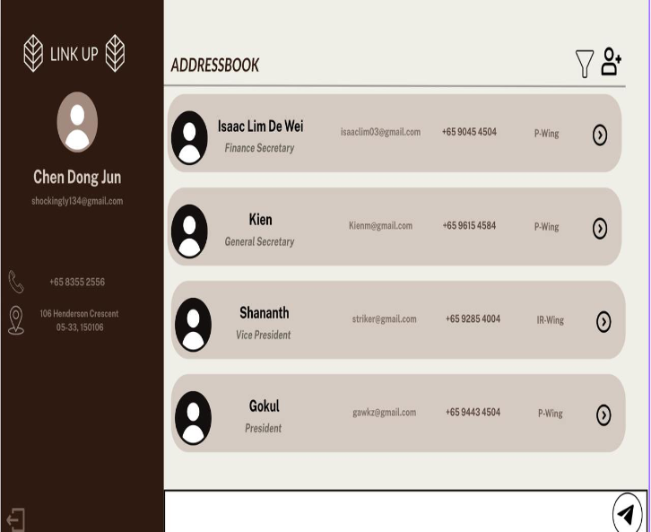

[](https://github.com/AY2526S1-CS2103T-F13-2/tp/actions/workflows/gradle.yml)
# LinkUp
## AY2526S1-CS2103-F13-2



This project is based on the AddressBook-Level3 project created by the [SE-EDU initiative](https://se-education.org).

## About This Project

Our group observed that our peers who hold leadership commitments struggle to manage contacts effectively.
Traditional address books quickly become *messy and overwhelming* when handling large numbers of people.
Leaders not only need to store contact details, but also keep track of roles and event-specific groups,
making coordination difficult.


To solve this, we created LinkUp — a lightweight, intuitive contact management tool designed for
**Community & Club leaders**.

With LinkUp, leaders can:
* Filter contacts based on events (e.g. orientation organising members)
* Organise people by role (e.g. family, event volunteers, event organisers)
* Onboard new team members effortlessly
* Avoid the complexity of heavy software while keeping everything streamlined

## Getting Started
To set up LinkUp locally on your computer and get it up and running, follow these simple example steps.

### Prerequisites
To run this project, you need:
1. **Java Development Kit (JDK) 17**

This project requires Java version 17. You can download it from
[Oracle](https://www.oracle.com/java/technologies/javase/jdk17-archive-downloads.html).

Steps to install:
* Download the JDK installer for your operating system.
* Follow the installation instructions.
* Verify installation by opening a terminal or command prompt and running:
```
java -version
```
You should see something like:
```
java version "17.0.x"
```

2. **IntelliJ IDEA (IDE)**

We recommend using IntelliJ IDEA to run and manage this project. However, other
IDEs could work too.

Steps to install:
* Download IntelliJ IDEA Community Edition (free) from [JetBrains](https://www.jetbrains.com/idea/download/?section=mac)
* Launch IntelliJ and open a new Java project via ```File → New → Project```
* Ensure that the file is configured to use JDK 17:
  * Go to ```File → Project Structure → Project → Project SDK ```
  * Selected JDK 17 as the SDK if it is not already chosen

### Installation
To download the relevant code,
1. Clone our remote repository
```
git clone https://github.com/AY2526S1-CS2103T-F13-2/tp.git
```
2. Navigate to the ```Main``` file via ```tp → src → main → java → seedu.address → Main```
and run it


## Usage

### Help
*Shows a message explaining how to access the help page.*

Format: ```help```

### Add
*Adds a person to the address book.*

Format: ```add n/NAME p/PHONE_NUMBER e/EMAIL a/ADDRESS [t/TAG]...```

Examples:

* ```add n/John Doe p/98765432 e/johnd@example.com a/John street, block 123, #01-01```
* ```add n/Betsy Crowe t/friend e/betsycrowe@example.com a/Newgate Prison p/1234567 t/criminal```

### Edit
*Edits an existing person in the address book.*

Format: ```edit INDEX [n/NAME] [p/PHONE] [e/EMAIL] [a/ADDRESS] [t/TAG]...```

* Edits the person at the specified ```INDEX```. The index refers to the index number shown in the displayed person
list. The index must be a positive integer 1, 2, 3, …​
* At least one of the optional fields must be provided.
* Existing values will be updated to the input values.
* When editing tags, the existing tags of the person will be **removed** i.e adding of tags is not cumulative.
* You can remove all the person’s tags by typing t/ without specifying any tags after it.

Examples:

* edit 1 p/91234567 e/johndoe@example.com Edits the phone number and email address of the 1st person to be 91234567 and johndoe@example.com respectively.
* edit 2 n/Betsy Crower t/ Edits the name of the 2nd person to be Betsy Crower and clears all existing tags.

### List
*Shows a list of all persons in the address book.*

Format: list

### Find
*Finds persons whose names contain any of the given keywords.*

Format: ```find KEYWORD [MORE_KEYWORDS]```

* The search is case-insensitive. e.g ```hans``` will match ```Hans```
* The order of the keywords does not matter. e.g. ```Hans Bo``` will match ```Bo Hans```
* Only the name is searched.
* Only full words will be matched e.g. ```Han``` will not match ```Hans```
* Persons matching at least one keyword will be returned (i.e. ```OR``` search).
e.g. ```Hans Bo``` will return ```Hans Gruber```, ```Bo Yang```

Examples:

* ```find John``` returns ```john``` and ```John Doe ```
* ```find alex david``` returns ```Alex Yeoh```, ```David Li```

### Delete
*Deletes the specified person from the address book.*

Format: ```delete INDEX```

* Deletes the person at the specified ```INDEX```.
* The index refers to the index number shown in the displayed person list.
* The index must be a **positive integer** 1, 2, 3, …
  Examples:

```list``` followed by ```delete 2``` deletes the 2nd person in the address book.
```find Betsy``` followed by ```delete 1``` deletes the 1st person in the results of the find command.


### Clear
*Clears all entries from the address book.*

Format: ```clear```

### Exit
*Exits the program.*

Format: ```exit```
