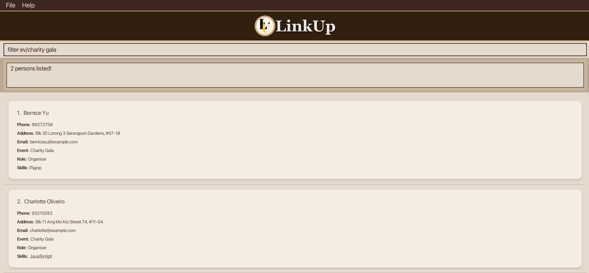

[](https://github.com/AY2526S1-CS2103T-F13-2/tp/actions/workflows/gradle.yml)
# LinkUp
## AY2526S1-CS2103-F13-2


This project is based on the AddressBook-Level3 project created by the [SE-EDU initiative](https://se-education.org).

## About This Project

Our group observed that our peers who hold leadership commitments struggle to manage contacts effectively.
Traditional address books quickly become *messy and overwhelming* when handling large numbers of people.
Leaders not only need to store contact details, but also keep track of roles and event-specific groups,
making coordination difficult.

To solve this, we created **LinkUp** — a lightweight, intuitive contact management tool designed for
community and club leaders.

With **LinkUp**, leaders can:
* Filter contacts based on events (e.g. orientation organising members)
* Organise people by role (e.g. family, event volunteers, event organisers)
* Onboard new team members effortlessly
* Avoid the complexity of heavy software while keeping everything streamlined

## Getting Started
To set up LinkUp locally on your computer and get it up and running, follow these simple steps.

### Prerequisites
To run this project, you need **Java Development Kit (JDK) 17**.

Steps for JDK 17 installation:
* Download the JDK installer for your operating system from [here](https://www.oracle.com/java/technologies/javase/jdk17-archive-downloads.html).
* Follow the installation instructions.
* Verify installation by opening a terminal or command prompt and running:
```
java -version
```
You should see something like:
```
java version "17.0.x"
```

2. **IntelliJ IDEA (IDE)**

We recommend using IntelliJ IDEA to run and manage this project. However, other
IDEs could work too.

Steps to install:
* Download IntelliJ IDEA Community Edition (free) from [JetBrains](https://www.jetbrains.com/idea/download/?section=mac).
* Launch IntelliJ and open a new Java project via ```File → New → Project```
* Ensure that the file is configured to use JDK 17:
  * Go to ```File → Project Structure → Project → Project SDK ```
  * Selected JDK 17 as the SDK if it is not already chosen

### Installation
To download the relevant code,
1. Clone our remote repository
```
git clone https://github.com/AY2526S1-CS2103T-F13-2/tp.git
```
2. Navigate to the ```Main``` file via ```tp → src → main → java → seedu.address → Main```
and run it


## Important Notes

* Words in uppercase are information you need to provide.<br>
  e.g. For `add n/NAME`, replace `NAME` with an actual name.
    * You can type in `add n/John Doe` or `add n/Michael Jordan` etc.

* Items in square brackets are optional.<br>
  e.g. In `n/NAME [s/SKILL]`, `s/SKILL` is optional.
    * You can type `n/John Doe s/Java` or `n/John Doe`.

* Items with `…`​ after them can be used multiple times (including not at all).<br>
  e.g. `[s/SKILL]…​` means you can add 0 skills, 1 skill, or many.
    * You can type ` ` (i.e. 0 times), `s/Java`, or `s/Photography s/Cooking` etc.

* Fields can be in any order.<br>
  e.g. If a command specifies `n/NAME p/PHONE_NUMBER`, `p/PHONE_NUMBER n/NAME` is also acceptable.

* Extra parameters for commands that do not take in parameters (such as `help`, `list`, `exit` and `clear`) will be ignored.<br>
  e.g. If you type in `help 123`, it will be treated as just `help`.

* If you are using a PDF version of this document, be careful when copying and pasting commands that span multiple lines as
  space characters surrounding line-breaks may be omitted when copied over to the application.

## Features
### View Help

View a brief message on commands you can use and a pop-up message explaining how to access the help page.

**Format**: <br> `help` or `h`

### Add a Contact

Add a person to the address book.

**Format**: <br> `add n/NAME p/PHONE_NUMBER e/EMAIL t/TELEGRAM_HANDLE ev/EVENT r/ROLE [s/SKILL]…​` or <br>
`a n/NAME p/PHONE_NUMBER e/EMAIL t/TELEGRAM ev/EVENT r/ROLE [s/SKILL]…​`

<div markdown="span" class="alert alert-primary">:bulb: **Tip:**
A person can have any number of skills (including 0)
</div>

**Example Input**:
* `add n/John Deez p/98765431 ev/Supernova r/Organiser e/johnde@example.com t/john123, #01-01`

**Expected Output**:
* `New person added: John Deez; Phone: 98765431; Telegram: Johnstreet; Email: johnde@example.com; Role: Organiser; Event: Supernova; Skills: `

**Example Input**:
* `a n/Betsy Crowe s/Java e/betsycrowe@example.com t/crownie ev/Supernova r/Organiser p/1234567 s/Photography s/Java`

**Expected Output**:
* `New person added: Betsy Crowe; Phone: 1234567; Telegram: crownie; Email: betsycrowe@example.com; Role: Organiser; Event: Supernova; Skills: [Photography][Java]`

<div markdown="span" class="alert alert-primary">:bulb: **Tip:**
The order of fields do not matter!
</div>

### List all Contacts

View a list of all persons in the address book.

**Format**: <br> `list` or `l`

### Edit a Contact

Edit the details of an existing person in the address book.

**Format**: <br> `edit INDEX [n/NAME] [p/PHONE] [e/EMAIL] [t/TELEGRAM] [ev/EVENT] [r/ROLE] [s/SKILL]…​` or <br>
`e INDEX [n/NAME] [p/PHONE] [e/EMAIL] [t/TELEGRAM] [ev/EVENT] [r/ROLE] [s/SKILL]…​`

* Edit the details of the person at the specified `INDEX`. The index refers to the index number shown in the displayed person list. The index must be a positive integer 1, 2, 3, …​
* At least one of the optional fields must be provided.
* When editing skills, the existing skills of the person will be removed and replaced with your skills input i.e adding of skills is not cumulative.
* You can remove a person’s skills by typing `s/` without specifying any skills after it.

**Examples**:
*  `edit 1 p/91234567 e/johndoe@example.com` Edits the phone number and email address of the 1st person to be `91234567` and `johndoe@example.com` respectively.

**Expected Output**:
* `Edited Person: John Deez; Phone: 91234567; Telegram: Johnstreet, block 123, #01-01; Email: johndoe@example.com; Role: Organiser; Event: Supernova; Skills:`

**Example Input**:
*  `e 2 n/Betsy Crower s/` Edits the name of the 2nd person to be `Betsy Crower` and clears all existing skills.

**Expected Output**:
* `Edited Person: Betsy Crower; Phone: 1234567; Telegram: crownie; Email: betsycrowe@example.com; Role: Organiser; Event: Supernova; Skills:`

### Search for Contacts by Name

Find persons whose names contain any of the given keywords.

**Format**: <br> `find KEYWORD [MORE_KEYWORDS]` or `f KEYWORD [MORE_KEYWORDS]`

* The search is case-insensitive. e.g. `hans` will match `Hans`.
* The order of the keywords does not matter. e.g. `Hans Bo` will match `Bo Hans`.
* Only the name is searched.
* Only full words will be matched. e.g. `Han` will not match `Hans`.
* Persons matching at least one keyword will be returned.
  e.g. `Hans Bo` will return `Hans Gruber`, `Bo Yang`.

**Example Input**:
* `f alex david` <br>

**Expected Output**: <br>
If there are Alex Yeoh and David Li in your contacts, the output will be as such.


### Filter Contacts by any fields

Filter contacts from the address book based on name, event, role, phone number, telegram, email and skills.

**Format**: <br> `filter [n/KEYWORD] [t/KEYWORD] [ev/KEYWORD] [r/KEYWORD] [s/KEYWORD]` or <br>
`fil [n/KEYWORD] [t/KEYWORD] [ev/KEYWORD] [r/KEYWORD] [s/KEYWORD]`

* Filter the address book based on specified `KEYWORD`.
* Filter and produces all possible outputs based on the keyword.
* Can filter many words of a field by using space. e.g. `n/Alice Bob` will match all people have `Alice` or `Bob` in their name
* The keyword is case-insensitive. e.g. `ev/Supernova` will match `ev/supernova`.
* For email, phone and telegram handle, a substring of a word will be matched. e.g. `@gmail.com` will match `alice@gmail.com`.
* For the rest, only full words will be matched. e.g. `Hackatho` will not match `Hackathon`.
* The keyword **can be any valid character** 1, a, @, …​

**Example Input**:
* `filter ev/charity gala`

**Expected Output**: <br>
If there are contacts with Charity Gala as their event, the output will be as such.



### Delete a Contact

Delete a specified person from the address book.

**Format**: <br> `delete INDEX` or `d INDEX`

* Delete the person at the specified `INDEX`.
* The index refers to the index number shown in the displayed person list.
* The index **must be a positive integer** 1, 2, 3, …​

**Example Input**:
* `list` followed by `delete 1` deletes the 1st person in the address book.

**Expected Output**:
* `Deleted Person: John Deez; Phone: 91234567; Telegram: Johnstreet, block 123, #01-01; Email: johndoe@example.com; Role: Organiser; Event: Supernova; Skills:`

**Example Input**:
* `find Betsy` followed by `d 1` deletes the 1st person in the results of the `find` command.

**Expected Output**:
* `Deleted Person: Betsy Crower; Phone: 1234567; Telegram: crownie; Email: betsycrowe@example.com; Role: Organiser; Event: Supernova; Skills:`

### Delete ALL Contacts

Clear all persons from the address book.

**Format**: <br> `clear`

**Expected Output**:
* `Address book has been cleared!`

### Add a Contact to Favourites

Add a specified person from the address book to favourites.

**Format**: <br> `fav INDEX`

* Add the person at the specified `INDEX` to favourites.
* The index refers to the index number shown in the displayed person list.
* The index **must be a positive integer** 1, 2, 3, …​

**Example Input**:
* `list` followed by `fav 1` adds the 1st person in the address book to favourites.

**Expected Output**:
* `Marked John Deez as favourite.`

**Example Input**:
* `find Betsy` followed by `fav 1` adds the 1st person in the results of the `find` command to favourites.

**Expected Output**:
* `Marked Betsy Crower as favourite.`

### Remove a Contact from Favourites

Remove a specified person from the address book from favourites.

**Format**: <br> `unfav INDEX`

* Remove the person at the specified `INDEX` from favourites.
* The index refers to the index number shown in the displayed person list.
* The index **must be a positive integer** 1, 2, 3, …​

**Example Input**:
* `list` followed by `unfav 1` removes the 1st person in the address book from favourites.

**Expected Output**:
* `Unmarked John Deez from favourites.`

**Example Input**:
* `find Betsy` followed by `unfav 1` removes the 1st person in the results of the `find` command from favourites.

**Expected Output**:
* `Unmarked Betsy Crower from favourites.`

### List all Favourite Contacts

View a list of all your favourite persons in the address book.

**Format**: <br> `lfav`

### Close LinkUp

Exit the application.

**Format**: <br> `exit`

The GUI will close after the input. LinkUp saves your contact list automatically in your computer.
This means that your contact list will be restored whenever you reopen LinkUp.

### Save the Data

LinkUp data is saved in the hard disk automatically after any command that changes the data. There is no need to save manually.
