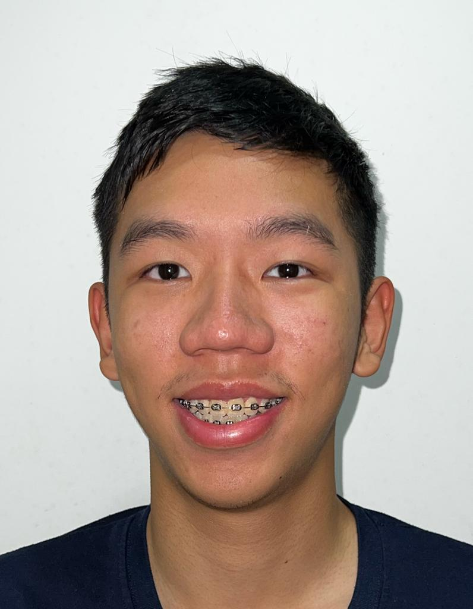
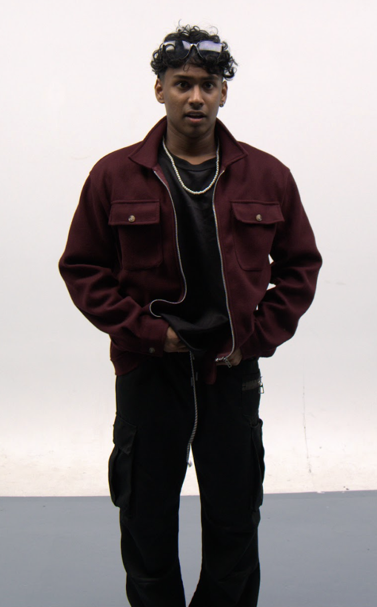
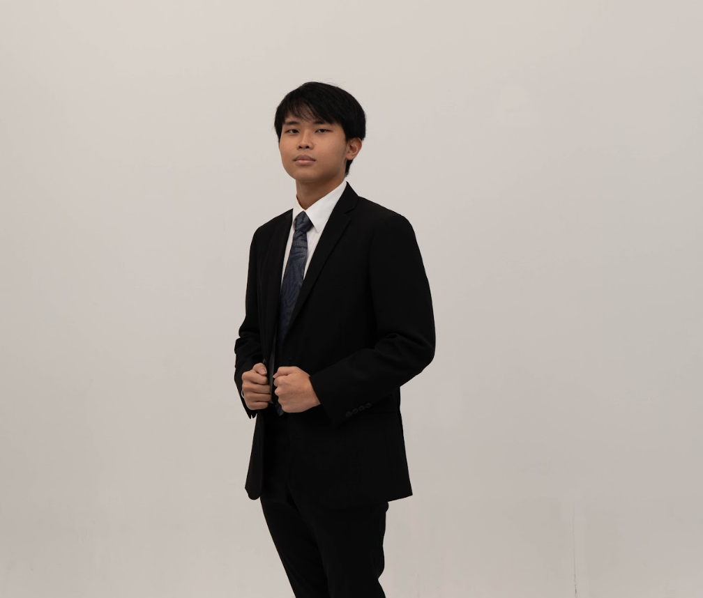

# About Us

We are a team based in the [School of Computing, National University of Singapore](http://www.comp.nus.edu.sg).

## Project team

### Lee Jin Timothy

[[github](https://github.com/timothyleejin)]
[[portfolio](team/timothyleejin.md)]

* Role: Team Lead
* Responsibilities: UI

### Isaac Lim

[[github](http://github.com/isaaclim01)]
[[portfolio](team/isaaclim.md)]

* Role: Documentation
* Responsibilities: Storage

### Shananth Sivakumar

[[github](http://github.com/shockingly134)] [[portfolio](team/shockingly134.md)]

* Role: Code Quality & Testing
* Responsibilities: Data

### Kien

[[github](http://github.com/kineeeeee)]
[[portfolio](team/dinhkiennguyen.md)]

* Role: Developer
* Responsibilities: Dev Ops + Threading

### Chen Dong Jun

[[github](http://github.com/strikerprv)]
[[portfolio](team/strikerprv.md)]

* Role: Developer
* Responsibilities: Model
