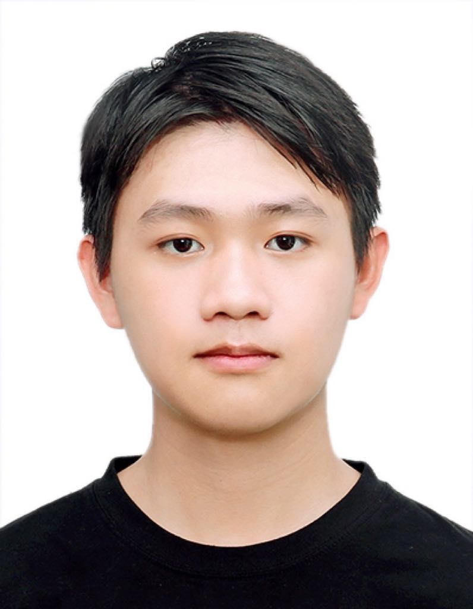

We are a team based in the [School of Computing, National University of Singapore](https://www.comp.nus.edu.sg).

You can reach us at the email `seer[at]comp.nus.edu.sg`

## Project team

### Isaac Lim De Wei

[[homepage](http://www.comp.nus.edu.sg/~damithch)]
[[github](https://github.com/johndoe)]
[[portfolio](team/johndoe.md)]

* Role: Team Lead
* Responsibilities: UI

### Shananth Sivakumar

[[github](http://github.com/shockingly134)]
[[portfolio](team/johndoe.md)]

* Role: Documentation
* Responsibilities: Storage

### Timothy Lee

[[github](http://github.com/timothyleejin)] [[portfolio](team/johndoe.md)]

* Role: Code Quality & Testing
* Responsibilities: Data

### Kien

[[github](http://github.com/kineeeeee)]
[[portfolio](team/johndoe.md)]

* Role: Developer
* Responsibilities: Dev Ops + Threading

### Chen Dong Jun

[[github](http://github.com/strikerprv)]
[[portfolio](team/strikerprv.md)]

* Role: Developer
* Responsibilities: Model
