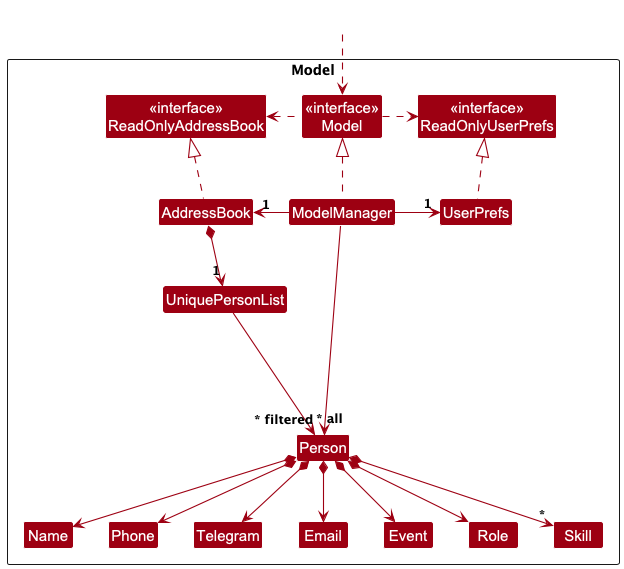

* Table of Contents
{:toc}

## **Acknowledgements**

* {list here sources of all reused/adapted ideas, code, documentation, and third-party libraries -- include links to the original source as well}

--------------------------------------------------------------------------------------------------------------------

## **Setting up, getting started**

Refer to the guide [_Setting up and getting started_](SettingUp.md).

--------------------------------------------------------------------------------------------------------------------

## **Design**

:bulb: **Tip:** The `.puml` files used to create diagrams are in this document `docs/diagrams` folder. Refer to the [_PlantUML Tutorial_ at se-edu/guides](https://se-education.org/guides/tutorials/plantUml.html) to learn how to create and edit diagrams.

### Architecture

The ***Architecture Diagram*** given above explains the high-level design of the App.

Given below is a quick overview of main components and how they interact with each other.

**Main components of the architecture**

**`Main`** (consisting of classes [`Main`](https://github.com/AY2526S1-CS2103T-F13-2/tp/blob/master/src/main/java/seedu/address/Main.java) and [`MainApp`](https://github.com/AY2526S1-CS2103T-F13-2/tp/blob/master/src/main/java/seedu/address/MainApp.java)) is in charge of the app launch and shut down.
* At app launch, it initializes the other components in the correct sequence, and connects them up with each other.
* At shut down, it shuts down the other components and invokes cleanup methods where necessary.

The bulk of the app's work is done by the following four components:

* [**`UI`**](#ui-component): The UI of the App.
* [**`Logic`**](#logic-component): The command executor.
* [**`Model`**](#model-component): Holds the data of the App in memory.
* [**`Storage`**](#storage-component): Reads data from, and writes data to, the hard disk.

[**`Commons`**](#common-classes) represents a collection of classes used by multiple other components.

**How the architecture components interact with each other**

The *Sequence Diagram* below shows how the components interact with each other for the scenario where the user issues the command `delete 1`.

Each of the four main components (also shown in the diagram above),

* defines its *API* in an `interface` with the same name as the Component.
* implements its functionality using a concrete `{Component Name}Manager` class (which follows the corresponding API `interface` mentioned in the previous point.

For example, the `Logic` component defines its API in the `Logic.java` interface and implements its functionality using the `LogicManager.java` class which follows the `Logic` interface. Other components interact with a given component through its interface rather than the concrete class (reason: to prevent outside component's being coupled to the implementation of a component), as illustrated in the (partial) class diagram below.

The sections below give more details of each component.

### UI component

The **API** of this component is specified in [`Ui.java`](https://github.com/AY2526S1-CS2103T-F13-2/tp/blob/master/src/main/java/seedu/address/ui/Ui.java)

The UI consists of a `MainWindow` that is made up of parts e.g.`CommandBox`, `ResultDisplay`, `PersonListPanel`, `StatusBarFooter` etc. All these, including the `MainWindow`, inherit from the abstract `UiPart` class which captures the commonalities between classes that represent parts of the visible GUI.

The `UI` component uses the JavaFx UI framework. The layout of these UI parts are defined in matching `.fxml` files that are in the `src/main/resources/view` folder. For example, the layout of the [`MainWindow`](https://github.com/AY2526S1-CS2103T-F13-2/tp/blob/master/src/main/java/seedu/address/ui/MainWindow.java) is specified in [`MainWindow.fxml`](https://github.com/AY2526S1-CS2103T-F13-2/tp/blob/master/src/main/resources/view/MainWindow.fxml)

The `UI` component,

* executes user commands using the `Logic` component.
* listens for changes to `Model` data so that the UI can be updated with the modified data.
* keeps a reference to the `Logic` component, because the `UI` relies on the `Logic` to execute commands.
* depends on some classes in the `Model` component, as it displays `Person` object residing in the `Model`.

### Logic component

**API** : [`Logic.java`](https://github.com/AY2526S1-CS2103T-F13-2/tp/blob/master/src/main/java/seedu/address/logic/Logic.java)

Here's a (partial) class diagram of the `Logic` component:

The sequence diagram below illustrates the interactions within the `Logic` component, taking `execute("delete 1")` API call as an example.

This sequence diagram illustrates a more complex interaction within the `Logic` component, taking `execute("filter ev/cycling")` API call as the example.

:information_source: **Note:** The lifeline for `DeleteCommandParser` and `FilterCommandParser` should end at the destroy marker (X) but due to a limitation of PlantUML, the lifeline continues till the end of diagram.

How the `Logic` component works:

1. When `Logic` is called upon to execute a command, it is passed to the LinkUp `AddressBookParser` object which in turn creates a parser that matches the command (e.g., `DeleteCommandParser`) and uses it to parse the command.
1. This results in a `Command` object (more precisely, an object of one of its subclasses e.g., `DeleteCommand`) which is executed by the `LogicManager`.
1. The command can communicate with the `Model` when it is executed (e.g. to delete a person). 
   Note that although this is shown as a single step in the diagram above (for simplicity), in the code it can take several interactions (between the command object and the `Model`) to achieve.
1. The result of the command execution is encapsulated as a `CommandResult` object which is returned back from `Logic`.

Here are the other classes in `Logic` (omitted from the class diagram above) that are used for parsing a user command:

How the parsing works:
* When called upon to parse a user command, the `AddressBookParser` class creates an `XYZCommandParser` (`XYZ` is a placeholder for the specific command name e.g., `AddCommandParser`) which uses the other classes shown above to parse the user command and create a `XYZCommand` object (e.g., `AddCommand`) which the `AddressBookParser` returns back as a `Command` object.
* All `XYZCommandParser` classes (e.g., `AddCommandParser`, `DeleteCommandParser`, ...) inherit from the `Parser` interface so that they can be treated similarly where possible e.g, during testing.

### Model component
**API** : [`Model.java`](https://github.com/AY2526S1-CS2103T-F13-2/tp/blob/master/src/main/java/seedu/address/model/Model.java)

The `Model` component,

* stores the address book data i.e., all `Person` objects (which are contained in a `UniquePersonList` object).
* stores the currently 'selected' `Person` objects (e.g., results of a search query) as a separate _filtered_ list which is exposed to outsiders as an unmodifiable `ObservableList<Person>` that can be 'observed' e.g. the UI can be bound to this list so that the UI automatically updates when the data in the list change.
* stores a `UserPref` object that represents the user’s preferences. This is exposed to the outside as a `ReadOnlyUserPref` objects.
* does not depend on any of the other three components (as the `Model` represents data entities of the domain, they should make sense on their own without depending on other components)

### Storage component

**API** : [`Storage.java`](https://github.com/AY2526S1-CS2103T-F13-2/tp/blob/master/src/main/java/seedu/address/storage/Storage.java)

The `Storage` component,
* can save both address book data and user preference data in JSON format, and read them back into corresponding objects.
* inherits from both `AddressBookStorage` and `UserPrefStorage`, which means it can be treated as either one (if only the functionality of only one is needed).
* depends on some classes in the `Model` component (because the `Storage` component's job is to save/retrieve objects that belong to the `Model`)

### Common classes

Classes used by multiple components are in the `seedu.address.commons` package.

--------------------------------------------------------------------------------------------------------------------

## **Implementation**

This section describes some noteworthy details on how certain features are implemented.

### \[Proposed\] Undo/redo feature

#### Proposed Implementation

The proposed undo/redo mechanism is facilitated by `VersionedAddressBook`. It extends `AddressBook` with an undo/redo history, stored internally as an `addressBookStateList` and `currentStatePointer`. Additionally, it implements the following operations:

* `VersionedAddressBook#commit()` — Saves the current address book state in its history.
* `VersionedAddressBook#undo()` — Restores the previous address book state from its history.
* `VersionedAddressBook#redo()` — Restores a previously undone address book state from its history.

These operations are exposed in the `Model` interface as `Model#commitAddressBook()`, `Model#undoAddressBook()` and `Model#redoAddressBook()` respectively.

Given below is an example usage scenario and how the undo/redo mechanism behaves at each step.

Step 1. The user launches the application for the first time. The `VersionedAddressBook` will be initialized with the initial address book state, and the `currentStatePointer` pointing to that single address book state.

Step 2. The user executes `delete 5` command to delete the 5th person in the address book. The `delete` command calls `Model#commitAddressBook()`, causing the modified state of the address book after the `delete 5` command executes to be saved in the `addressBookStateList`, and the `currentStatePointer` is shifted to the newly inserted address book state.

Step 3. The user executes `add n/David …​` to add a new person. The `add` command also calls `Model#commitAddressBook()`, causing another modified address book state to be saved into the `addressBookStateList`.

:information_source: **Note:** If a command fails its execution, it will not call `Model#commitAddressBook()`, so the address book state will not be saved into the `addressBookStateList`.

Step 4. The user now decides that adding the person was a mistake, and decides to undo that action by executing the `undo` command. The `undo` command will call `Model#undoAddressBook()`, which will shift the `currentStatePointer` once to the left, pointing it to the previous address book state, and restores the address book to that state.

:information_source: **Note:** If the `currentStatePointer` is at index 0, pointing to the initial AddressBook state, then there are no previous AddressBook states to restore. The `undo` command uses `Model#canUndoAddressBook()` to check if this is the case. If so, it will return an error to the user rather
than attempting to perform the undo.

The following sequence diagram shows how an undo operation goes through the `Logic` component:

:information_source: **Note:** The lifeline for `UndoCommand` should end at the destroy marker (X) but due to a limitation of PlantUML, the lifeline reaches the end of diagram.

Similarly, how an undo operation goes through the `Model` component is shown below:

The `redo` command does the opposite — it calls `Model#redoAddressBook()`, which shifts the `currentStatePointer` once to the right, pointing to the previously undone state, and restores the address book to that state.

:information_source: **Note:** If the `currentStatePointer` is at index `addressBookStateList.size() - 1`, pointing to the latest address book state, then there are no undone AddressBook states to restore. The `redo` command uses `Model#canRedoAddressBook()` to check if this is the case. If so, it will return an error to the user rather than attempting to perform the redo.

Step 5. The user then decides to execute the command `list`. Commands that do not modify the address book, such as `list`, will usually not call `Model#commitAddressBook()`, `Model#undoAddressBook()` or `Model#redoAddressBook()`. Thus, the `addressBookStateList` remains unchanged.

Step 6. The user executes `clear`, which calls `Model#commitAddressBook()`. Since the `currentStatePointer` is not pointing at the end of the `addressBookStateList`, all address book states after the `currentStatePointer` will be purged. Reason: It no longer makes sense to redo the `add n/David …​` command. This is the behavior that most modern desktop applications follow.

The following activity diagram summarizes what happens when a user executes a new command:

#### Design considerations:

**Aspect: How undo & redo executes:**

* **Alternative 1 (current choice):** Saves the entire address book.
  * Pros: Easy to implement.
  * Cons: May have performance issues in terms of memory usage.

* **Alternative 2:** Individual command knows how to undo/redo by
  itself.
  * Pros: Will use less memory (e.g. for `delete`, just save the person being deleted).
  * Cons: We must ensure that the implementation of each individual command are correct.

_{more aspects and alternatives to be added}_

### \[Proposed\] Data archiving

_{Explain here how the data archiving feature will be implemented}_

--------------------------------------------------------------------------------------------------------------------

## **Documentation, logging, testing, configuration, dev-ops**

* [Documentation guide](Documentation.md)
* [Testing guide](Testing.md)
* [Logging guide](Logging.md)
* [Configuration guide](Configuration.md)
* [DevOps guide](DevOps.md)

--------------------------------------------------------------------------------------------------------------------

## **Appendix: Requirements**

### Product scope

**Target user profile**:

* are small-scale leaders and organizers who need a lightweight but effective way to manage and access
  their contacts without relying on large enterprise tools
* has a need to manage a significant number of contacts
* prefer desktop apps over other types
* can type fast
* prefers typing to mouse interactions
* is reasonably comfortable using CLI apps

**Primary Users**:

* Community & Club Leaders (e.g., student societies, cultural clubs, sports teams)
* Non-Profit & Volunteer Leads (e.g., NGO project leads, charity group organizers)
* Small Organization / Business Team Leads (e.g., startups, tuition centers, hobby groups)

**User Persona**:

* Bryce is a university student studying a non-IT field. He is involved in many university clubs and leads some of them.
He needs to store and access many contacts easily, but does not require integrated communication features.

**Value proposition**:

* provides a lightweight and simple contact management tool
* manage contacts faster than a typical mouse/GUI driven app
* helps small organizations and student leaders organize their contacts more effectively than spreadsheets
* avoids unnecessary complexity while still supporting features like search, labeling, and grouping

### User stories

Priorities: High (must have) - `* * *`, Medium (nice to have) - `* *`, Low (unlikely to have) - `*`

| Priority | As a …​               | I want to …​                                       | So that I can…​                                                                     |
|----------|-----------------------|----------------------------------------------------|-------------------------------------------------------------------------------------|
| `* * *`  | new user              | see usage instructions/help                        | refer to instructions when I forget how to use the App                              |
| `* * *`  | user                  | add a contact                                      | record down people’s details                                                        |
| `* * *`  | user                  | delete a contact                                   | remove unnecessary entries                                                          |
| `* * *`  | user                  | view the contact list                              | see all contacts                                                                    |
| `* * *`  | user                  | edit a contact                                     | update their details                                                                |
| `* * *`  | user                  | search a contact by name                           | find them quickly                                                                   |
| `* * *`  | volunteer coordinator | tag contacts with skills                           | assign them to tasks                                                                |
| `* * *`  | leader                | add event/role/telegram information to contacts    | know their context                                                                  |
| `* * *`  | leader                | filter people by any field                         | find the relevant contacts                                                |
| `* * *`  | leader                | add favourite contacts and list them               | access key people easily                                                            |
| `* *`    | leader                | have clearer duplicate contact information         | understand which fields are duplicate more easily given the large number of contacts |
| `* *`    | experienced user      | delete multiple contacts                           | delete contacts faster after event                                                  |
| `* *`    | experienced user      | use command shortcuts                              | speed up workflow                                                                   |

### Use cases
(For all use cases below, the **System** is `LinkUp` and the **Actor** is the `user`, unless specified otherwise)

**Use case: Add Contact** 

**MSS**
1. User requests to add contact.
2. LinkUp adds the contact and displays updated list of contacts.   
   Use case ends.

**Extensions**
* 1a. LinkUp detects missing information.
    * 1a1.LinkUp displays an error message.   
  Use case ends.   
* 1b. Phone number and/or name and/or email already exist in LinkUp.
    * 1b1. LinkUp shows duplicate contact error message.   
  Use case ends.   
* 1c. Invalid field format (E.g. usage of alphabets in phone number)
    * 1c1. LinkUp shows invalid input message.   
  Use case ends.
* 1d. Invalid command format.
    * 1d1. LinkUp shows error message.   
  Use case ends.

**Use case: Find Contact** 

**MSS**
1. User finds contact.
2. LinkUp displays list of matching contacts.   
   Use case ends.

**Extensions**
* 1a. LinkUp finds no matching contacts.   
  Use case ends.   
* 1b. Invalid command format.
    * 1b1. LinkUp shows error message.   
      Use case ends.

**Use case: Delete Contact** 

**MSS**

1.  User requests to list persons.
2.  LinkUp shows a list of persons.
3.  User requests to delete a specific person in the list.
4.  LinkUp deletes the person.   
    Use case ends.

**Extensions**

* 2a. The list is empty.   
  Use case ends.   
* 3a. The given index is invalid.
    * 3a. LinkUp shows an error message.   
      Use case resumes at step 2.
* 3b. Invalid command format.
    * 3b1. LinkUp shows error message.   
      Use case resumes at step 2.

**Use case: Mark Contact as Favourite** 

**MSS**
1. User requests to list persons.
2. LinkUp shows a list of persons.
3. User requests to mark a specific contact as favourite.
4. LinkUp marks the contact as favourite, displays confirmation message, and adds heart symbol beside contact.   
   Use case ends.

**Extensions**
* 2a. The list is empty.   
  Use case ends.   
* 3a. The given index is invalid.
  *   3a1. LinkUp displays an error message.   
    Use case resumes at step 2.   
* 3b. The contact is already marked as favourite.
  *   3b1. LinkUp displays a message indicating that the contact is already favourite.   
    Use case resumes at step 2.   
* 3c. Invalid command format.
    * 3c1. LinkUp shows error message.   
      Use case resumes at step 2.

**Use case: Unmark Favourite Contact** 

**MSS**
1. User requests to list persons.
2. LinkUp shows a list of persons.
3. User requests to unmark a specific contact from favourites.
4. LinkUp marks the contact as favourite, displays confirmation message, and removes heart symbol beside contact.   
   Use case ends.

**Extensions**
* 2a. The list is empty.   
  Use case ends.   
* 3a. The given index is invalid.
    *   3a1. LinkUp displays an error message.   
        Use case resumes at step 2.   
* 3b. The contact is already unmarked from favourites.
    *   3b1. LinkUp displays a message indicating that the contact is already unmarked.   
        Use case resumes at step 2.   
* 3c. Invalid command format.
  * 3c1. LinkUp shows error message.   
    Use case resumes at step 2.

**Use case: List Favourite Contacts** 

**MSS**
1. User requests to view all favourite contacts.
2. LinkUp displays a list of favourite contacts.   
    Use case ends.   

**Extensions**
* 1a. There are no favourite contacts.
    * 1a1. LinkUp displays a message indicating that there are no favourites.   
    Use case ends.   
* 1b. Invalid command format.
    * 1b1. LinkUp shows error message.   
      Use case ends.

**Use case: Filter Contacts** 

**MSS**
1. User requests to filter contacts by any field.
2. LinkUp displays contacts that match the filter condition.   
   Use case ends.
   
**Extensions**
* 1a. No contacts match the filter condition.
    * 1a1. LinkUp displays “0 contacts listed!”   
    Use case ends.   
   
* 1b. Invalid command format.
   * 1b1. LinkUp shows error message.   
   Use case ends.   

**Use case: Clear All Contacts** 

**MSS**
1. User requests to clear all contacts.
2. LinkUp deletes all contacts and displays an empty list.   
   Use case ends.   

**Extensions**
* 1a. Invalid command format.
    * 1a1. LinkUp shows error message.   
      Use case ends.   

**Use case: Add Skill**

**MSS**
1. User requests to add one or more skills to a specific contact.

2. LinkUp adds the specified skill(s) to the contact’s skill list.

3. LinkUp displays a success message and updates the contact’s details.

    Use case ends.

**Extensions**

1a. Invalid command format.
    * 1a1. LinkUp shows an error message.
    Use case ends.

1b. Skill(s) already exist for the contact.
* 1b2. LinkUp displays a error message indicating which skills were already present.
    Use case ends.

1c. The specified contact index is invalid.
* 1c1. LinkUp shows an error message
    Use case ends.

1d. Invalid skill added to contact
* 1c1. Linkup shows invalid skill error message
    Use case ends.

**Use case: Delete Skill**

**MSS**
1. User requests to delete one or more skills to a specific contact.

2. LinkUp delete the specified skill(s) to the contact’s skill list.

3. LinkUp displays a success message and updates the contact’s details.

   Use case ends.

**Extensions**

1a. Invalid command format.
* 1a1. LinkUp shows an error message.
Use case ends.

1b. No such skill exist for the contact.
* 1b2. LinkUp displays a error message indicating no skills.
  Use case ends.

1c. The specified contact index is invalid.
* 1c1. LinkUp shows an error message
  Use case ends.

1d. Invalid skill added to contact
* 1c1. Linkup shows invalid skill error message
  Use case ends.

**Use case: Copy**

**MSS**
1. User requests to copy the add command string of a specific contact using its index.

2. LinkUp copies the add command string of the specified contact to the clipboard.

3. LinkUp displays a success message indicating that the command has been copied.
   
    Use case ends.

**Extensions**

1a. Invalid command format.
* 1a1. LinkUp shows an error message.
  Use case ends.

1b. The specified contact index is invalid.
* 1c1. LinkUp shows an error message.
  Use case ends.

1c. Clipboard Operation Fails
* 1c1. (Cmd v) or (Ctrl v) does not work.
  * 1c2. LinkUp displays the command string in the result box for manual copying.
    Use case ends.

**Use case: Edit Contact** 

**MSS**
1. User requests to list persons.
2. LinkUp displays a list of persons.
3. User requests to edit a specific contact in the list by index.
4. LinkUp updates the person’s information with the new details.
5. LinkUp displays the updated contact list.   
   Use case ends.

**Extensions**
* 2a. The list is empty.   
  Use case ends.   
* 3a. The given index is invalid.
    *   3a1. LinkUp displays an error message.   
        Use case resumes at step 2.   
* 3b. The user provides invalid or incomplete fields (e.g., invalid email or phone format).
    *   3b1. LinkUp displays an error message.   
        Use case resumes at step 2.   
* 3c. The user does not specify any field to edit.   
    *   3c1. LinkUp displays a message indicating that at least one field must be provided.   
        Use case resumes at step 2.   
* 3d. The edited information results in a duplicate contact.
    * 3d1. LinkUp displays a duplicate contact error message.   
        Use case resumes at step 2.   
* 3e. Invalid command format.
    * 3e1. LinkUp shows error message.   
      Use case ends.   

**Use case: View Help** 

**MSS**
1. User requests to view help information.
2. LinkUp displays example commands and a help window.   
   Use case ends.

**Extensions**
* 1a. Invalid command format.
    * 1a1. LinkUp shows error message.   
      Use case ends.   

**Use case: Exit LinkUp** 

**MSS**
1. User requests to exit the app.
2. LinkUp closes.   
   Use case ends.

**Extensions**
* 1a. Invalid command format.
    * 1a1. LinkUp shows error message.   
      Use case ends.   

### Non-Functional Requirements

1. **LinkUp** should work on any mainstream OS as long as it has Java 17 or above installed. 
2. A user with above average typing speed for regular English text (i.e. not code, not system admin commands) should be able to accomplish most of the tasks faster using commands than using the mouse.
3. **LinkUp** can store up to 1000 contacts without any noticeable difference in performance for typical usage.
4. **LinkUp** responds to your inputs within 2 seconds.
5. **LinkUp** is usable even if you're _non-tech savvy_ and have never used
   **LinkUp** before.
6. Data from **LinkUp** will not be able to be sent to other users easily through
   **LinkUp**.
7. **LinkUp** should validate all input data and show clear error messages if the input data is invalid.
8. **LinkUp** complies with _PDPA_ regulations in storing data.

### Glossary

1. Mainstream OS**: Windows, Linux, Unix, MacOS
2. Non tech-savvy: Someone who has low experience and skill in using technology
3. GUI: Graphical User Interface
4. CLI: Command Line Interface
4. JDK: Java Development Kit
5. PDPA: Personal Data Protection Agreement, data collection with consent
6. Organiser: A person who arranges an event or activity and has multiple contacts

--------------------------------------------------------------------------------------------------------------------

## **Appendix: Instructions for manual testing**

Given below are instructions to test the app manually.

:information_source: **Note:** These instructions only provide a starting point for testers to work on;
testers are expected to do more *exploratory* testing.

### Launch and shutdown

1. Initial launch

   1. Download the jar file and copy into an empty folder

   1. Double-click the jar file  
   **Expected:** Shows the GUI with a set of sample contacts. The window size may not be optimum.

1. Saving window preferences

   1. Resize the window to an optimum size. Move the window to a different location. Close the window.

   1. Re-launch the app by double-clicking the jar file. 
   **Expected:** The most recent window size and location is retained.

1. Shutdown

    1. Press the close window button or type `exit`.  
    **Expected:** LinkUp will shut down instantly and save your contact data in your computer.

### Adding a person

1. Adding a person while all persons are being shown

   1. **Test case:** `add n/John Doe p/98765432 e/johnd@example.com t/abc123 ev/Double or Nothing r/Orientation Camp Organiser s/Cooking s/Python` 
      **Expected:** Contact is added to the list. Details of the new contact will be shown.

   1. **Test case:** `add n/John Doe p/98765432 e/johnd@example.com t/abc123 ev/Double or Nothing r/Orientation Camp Organiser s/Cooking s/Python` 
      **Expected:** Duplicate contact. No person is added. Error details shown in the status message.

   1. **Test case:** `add n/John e/john@example.com t/abc123 ev/Double or Nothing r/Orientation Camp Organiser s/Cooking s/Python` 
      **Expected:** Invalid command format. No person is added. Error details shown in the status message.

   1. **Other incorrect add commands to try:** `add`, `add n/John Doe p/^^^^^5432 e/johnd@example.com t/abc123 ev/Double or Nothing r/Orientation Camp Organiser`, `...`  
      **Expected:** Similar to previous.

### Deleting a person

1. Deleting a person while all persons are being shown

    1. **Prerequisites:** List all persons using the `list` command. Multiple persons in the list.

    1. **Test case:** `delete 1` 
       **Expected:** First contact is deleted from the list. Details of the deleted contact shown in the status message.

    1. **Test case:** `delete 0` 
       **Expected:** Invalid index. No person is deleted. Error details shown in the status message.

    1. **Other incorrect delete commands to try:** `delete`, `delete x`, `...` (where x is larger than the list size) 
       **Expected:** Similar to previous.

### Editing a person

1. Editing a person while all persons are being shown

    1. **Prerequisites:** List all persons using the `list` command. Multiple persons in the list.

    1. **Test case:** `edit 1 n/John` 
       **Expected:** First contact name is changed to `john`. Details of the deleted contact shown in the status message.

    1. **Test case:** `edit 0 n/John` 
       **Expected:** Invalid index. No person is edited. Error details shown in the status message.

    1. **Other incorrect edit commands to try:** `edit`, `edit 1 p/^^^`, `edit x`, `...` (where x is larger than the list size) 
       **Expected:** Similar to previous.

### Filtering contacts

1. Filtering persons while all persons are being shown

    1. **Test case:** `filter r/Organiser` 
       **Expected:** All contacts with the role as Organiser are listed.

    1. **Test case:** `filter` 
       **Expected:** Invalid command. No person is listed. Error details shown in the status message.

### Finding a person by name

1. Finding a person while all persons are being shown

    1. **Test case:** `find n/John` 
       **Expected:** All contacts with the name as John are listed.

   1. **Test case:** `find` 
      **Expected:** Invalid command. No person is listed. Error details shown in the status message.

### Marking/Unmarking a person as favourite

1. Marking/Unmarking a person as favourite while all persons are being shown

    1. **Prerequisites:** List all persons using the `list` command. Multiple persons in the list.

    1. **Test case:** `fav 1` 
       **Expected:** First contact is marked as favourite. A heart symbol appears beside the contact.

   1. **Test case:** `fav 1` again  
      **Expected:** Message that says 1st contact is already marked as favourite is shown.

    1. **Test case:** `unfav 0` 
       **Expected:** Invalid index. No person is unmarked from favourites. Error details shown in the status message.

    1. **Other incorrect favourite commands to try:** `fav`, `fav x`, `...` (where x is larger than the list size) 
       **Expected:** Similar to previous.

### Adding skill to a person

1. Adding skills to a person while all persons are being shown
    1. **Prerequisites:** List all persons using the `list` command. Multiple persons in the list.

    1. **Test case:** `addskill 1 s/adobe s/python` 
       **Expected:** First contact is added the skill `adobe` and `python`

    1. **Test case:** `addskill 1 s/adobe` again  
       **Expected:** Message that says 1st contact already has the inputted skill

    1. **Test case:** `addskill 0 s/jokes` 
       **Expected:** Invalid index. No person is added skill. Error details shown in the status message.
   
    1. **Test case:** `addskill 0 s/jok*91es` 
       **Expected:** Inavlid skill error message is shown, skills should be alphanumeric.
   
   1. **Other incorrect favourite commands to try:** `addskill abc`, `addskill 1 s/9%aggss`, `addskill x s/fight`
   (where x is larger than the list size) 
      **Expected:** Similar to previous.

### Deleting skill from a person

1. Adding skills to a person while all persons are being shown
    1. **Prerequisites:** List all persons using the `list` command. Multiple persons in the list.

    1. **Test case:** `dskill 1 s/adobe` 
       **Expected:** First contact removed of the skill `adobe`

    1. **Test case:** `dskill 0 s/jokes` 
       **Expected:** Invalid index. No person is added skill. Error details shown in the status message.

    1. **Test case:** `dskill 0 s/jok*91es` 
       **Expected:** Inavlid skill error message is shown, skills should be alphanumeric.

    1. **Other incorrect favourite commands to try:** `addskill abc`, `addskill 1 s/9%aggss`, `addskill x s/fight`
       (where x is larger than the list size) 
       **Expected:** Similar to previous.

### Copy

1. Adding skills to a person while all persons are being shown
    1. **Prerequisites:** List all persons using the `list` command. Multiple persons in the list.

    1. **Test case:** `copy 1 s` 
       **Expected:** Add command string of the first contact is copied to the clipboard. 
        Success message shown in the result display box.

    1. **Test case:** `copy 0` 
       **Expected:** Invalid index. No command is copied. Error details shown in the status message.

    1. **Other incorrect favourite commands to try:** `copy abc`, `copy s/9%aggss`, `copy x`
       (where x is larger than the list size) 
       **Expected:** Similar to previous.

### Saving data
1. Simulate saving data
   2. Launch LinkUp.
   3. Add/delete/edit a contact.
   4. Close LinkUp.
   5. Relaunch LinkUp.
   **Expected:** The edited contact list will be restored when you relaunch LinkUp. 

1. Simulate a missing file
      2. Close LinkUp.
      3. Head to the `data` folder of LinkUp.
      4. Delete the `addressbook.json` file.
      5. Relaunch LinkUp.  
      **Expected:** LinkUp loads and lists sample contacts.

1. Simulate a corrupted file
    2. Close LinkUp.
    3. Head to the `data` folder of LinkUp.
    4. Edit the contents of the `addressbook.json` file and add invalid characters (eg. $%^#).
    5. Relaunch LinkUp.  
       **Expected:** LinkUp's contact list will be empty.
