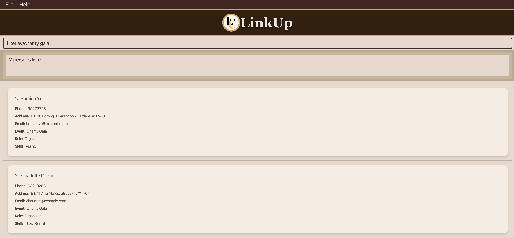

Meet **LinkUp**, a desktop app designed to help team leaders manage their contacts more efficiently and effectively. 
Optimized for users who prefer a Command Line Interface (CLI), **LinkUp** helps you manage your contacts without ever taking 
your hands off your keyboard.
--------------------------------------------------------------------------------------------------------------------
## Table of Contents
* Table of Contents
{:toc}
--------------------------------------------------------------------------------------------------------------------
## About This Guide
### Target Users
This app is tailored for **community and club leaders** responsible for:
* Tracking members' events and roles
* Recording members' skills to efficiently allocate work
* Communicating with members via messaging platforms (e.g., WhatsApp or Telegram) when needed

### Prior Knowledge
* Comfortable using messaging platforms like WhatsApp, Telegram, or email
* Basic digital literacy, including downloading software and typing commands
* Experience with keyboard-driven workflows to tackle tasks efficiently

### User Guide: Beginner to Experienced Users
* _New Users_: Start from the [_Quick Start_ section](#getting-started) to set up LinkUp on your computer
* _Intermediate Users_: Go to the [_Features_ section](#features) to learn how commands work
* _Experienced Users_: Refer to the [_Command Summary_](#command-summary) to quickly find and use commands
--------------------------------------------------------------------------------------------------------------------
## Getting Started

Let's walk you through the setup process of LinkUp.

1. **Prerequisites**:  
   Ensure you have Java `17` or above installed in your computer. You can type `java -version` in your command terminal
   of your computer to check.
   * For Mac users, follow the setup guide [here](https://se-education.org/guides/tutorials/javaInstallationMac.html)
     ensure you have the precise JDK version prescribed.
   * For Windows users, follow the setup guide [here](https://se-education.org/guides/tutorials/javaInstallationWindows.html)
     ensure you have the precise JDK version prescribed.
   * For Linux users, follow the setup guide [here](https://se-education.org/guides/tutorials/javaInstallationLinux.html)
     ensure you have the precise JDK version prescribed.

2. **Download**:  
   Install the latest `LinkUp.jar` file from [here](https://github.com/AY2526S1-CS2103T-F13-2/tp/releases).

3. **Move it**:  
   Place the `LinkUp.jar` file in your preferred folder in your computer.

4. **Run it**:  
   Open the command terminal of your computer, and navigate into the folder you put the `LinkUp.jar` file in. 
   You can do this by using the `cd` function. For example, if `LinkUp.jar` is in the Downloads folder of your computer,
   type `cd Downloads` in the command terminal to navigate into the Downloads folder.
   Finally, type `java -jar LinkUp.jar` command to run the application.  

5. **Use it**:   
   Now you can start using **LinkUp**. Refer to the [Features](#features) below for details of each command.

--------------------------------------------------------------------------------------------------------------------

## Features

**:information_source:  Notes about the command format:** 

* Words in uppercase are information you need to provide. 
  e.g. For `add n/NAME`, replace `NAME` with an actual name. 
  * You can type in `add n/John Doe` or `add n/Michael Jordan` etc.

* Items in square brackets are optional. 
  e.g. In `n/NAME [s/SKILL]`, `s/SKILL` is optional. 
  * You can type `n/John Doe s/Java` or `n/John Doe`.

* Items with `…`​ after them can be used multiple times (including not at all). 
  e.g. `[s/SKILL]…​` means you can add 0 skills, 1 skill, or many.
  * You can type ` ` (i.e. 0 times), `s/Java`, or `s/Photography s/Cooking` etc.

* Fields can be in any order. 
  e.g. If a command specifies `n/NAME p/PHONE_NUMBER`, `p/PHONE_NUMBER n/NAME` is also acceptable.

* Extra parameters for commands that do not take in parameters (such as `help`, `list`, `exit` and `clear`) will be ignored. 
  e.g. If you type in `help 123`, it will be treated as just `help`.

* If you are using a PDF version of this document, be careful when copying and pasting commands that span multiple lines as 
  space characters surrounding line-breaks may be omitted when copied over to the application.

### View Help

View a brief message on commands you can use and a pop-up message explaining how to access the help page. 

**Format**:   `help` or `h`

### Add a Contact

Add a person to the address book.

**Format**:   `add n/NAME p/PHONE_NUMBER e/EMAIL t/TELEGRAM_HANDLE ev/EVENT r/ROLE [s/SKILL]…​` or  
`a n/NAME p/PHONE_NUMBER e/EMAIL a/ADDRESS ev/EVENT r/ROLE [s/SKILL]…​`

:bulb: **Tip:**
A person can have any number of skills (including 0)

**Example Input**:
* `add n/John Deez p/98765431 ev/Supernova r/Organiser e/johnde@example.com t/john123, #01-01`

**Expected Output**:
* `New person added: John Deez; Phone: 98765431; Telegram: john123; Email: johnde@example.com; Role: Organiser; Event: Supernova; Skills: `

**Example Input**:
* `a n/Betsy Crowe s/Java e/betsycrowe@example.com t/crownie ev/Supernova r/Organiser p/1234567 s/Photography s/Java`

*Expected Output**:
* `New person added: Betsy Crowe; Phone: 1234567; Telegram: crownie; Email: betsycrowe@example.com; Role: Organiser; Event: Supernova; Skills: [Photography][Java]`

:bulb: **Tip:**
The order of fields do not matter!

### List all Contacts

View a list of all persons in the address book.

**Format**:   `list` or `l`

### Edit a Contact

Edit the details of an existing person in the address book.

**Format**:   `edit INDEX [n/NAME] [p/PHONE] [e/EMAIL] [t/TELEGRAM] [ev/EVENT] [r/ROLE] [s/SKILL]…​` or  
`e INDEX [n/NAME] [p/PHONE] [e/EMAIL] [t/TELEGRAM] [ev/EVENT] [r/ROLE] [s/SKILL]…​`

* Edit the details of the person at the specified `INDEX`. The index refers to the index number shown in the displayed person list. The index must be a positive integer 1, 2, 3, …​
* At least one of the optional fields must be provided.
* When editing skills, the existing skills of the person will be removed and replaced with your skills input i.e adding of skills is not cumulative.
* You can remove a person’s skills by typing `s/` without specifying any skills after it.

**Examples**:
*  `edit 2 p/91234567 e/johndoe@example.com` Edits the phone number and email address of the 1st person to be `91234567` and `johndoe@example.com` respectively.

**Expected Output**:
* `Edited Person: John Deez; Phone: 91234567; Address: John street, block 123, #01-01; Email: johndoe@example.com; Role: Organiser; Event: Supernova; Skills: : `

**Example Input**:
*  `e 1 n/Betsy Crower s/` Edits the name of the 2nd person to be `Betsy Crower` and clears all existing skills.

**Expected Output**:
* `Edited Person: Betsy Crower; Phone: 1234567; Address: Newgate Prison; Email: betsycrowe@example.com; Role: Organiser; Event: Supernova; Skills:`

### Search for Contacts by Name

Find persons whose names contain any of the given keywords.

**Format**:   `find KEYWORD [MORE_KEYWORDS]` or `f KEYWORD [MORE_KEYWORDS]`

* The search is case-insensitive. e.g. `hans` will match `Hans`.
* The order of the keywords does not matter. e.g. `Hans Bo` will match `Bo Hans`.
* Only the name is searched.
* Only full words will be matched. e.g. `Han` will not match `Hans`.
* Persons matching at least one keyword will be returned.
  e.g. `Hans Bo` will return `Hans Gruber`, `Bo Yang`.

**Example Input**:
* `f alex david` returns `Alex Yeoh`, `David Li` 
  

**Expected Output**:
* `2 persons listed!` 

### Filter Contacts by any fields

Filter contacts from the address book based on name, event, role, phone number, telegram, email and skills.

**Format**:   `filter [n/KEYWORD_1 KEYWORD_2] [ev/KEYWORD] [r/KEYWORD] [s/KEYWORD]` or   `fil [n/KEYWORD] [ev/KEYWORD] [r/KEYWORD] [s/KEYWORD]`

* Filter the address book based on specified `KEYWORD`.
* Filter and produces all possible outputs based on the keyword.
* Can filter many words of a field by using space. e.g. `n/Alice Bob` will match all people have `Alice` or `Bob` in their name
* The keyword is case-insensitive. e.g. `ev/Supernova` will match `ev/supernova`.
* For email, phone and telegram handle, a substring of a word will be matched. e.g. `@gmail.com` will match `alice@gmail.com`.
* For the rest, only full words will be matched. e.g. `Hackatho` will not match `Hackathon`.
* The keyword **can be any valid character** 1, a, @, …​

**Example Input**:
* `filter ev/charity gala` filters all the contacts which have the Charity Gala as their event.

**Expected Output**:
* `2 persons listed!`

### Delete a Contact

Delete a specified person from the address book.

**Format**:   `delete INDEX` or `d INDEX`

* Delete the person at the specified `INDEX`.
* The index refers to the index number shown in the displayed person list.
* The index **must be a positive integer** 1, 2, 3, …​

**Example Input**:
* `list` followed by `delete 2` deletes the 2nd person in the address book.

**Expected Output**
* `Deleted Person: John Deez; Phone: 91234567; Address: John street, block 123, #01-01; Email: johndoe@example.com; Role: Organiser; Event: Supernova; Skills: `

**Example Input**:
* `find Betsy` followed by `d 1` deletes the 1st person in the results of the `find` command.

**Expected Output**
* `Deleted Person: Betsy Crower; Phone: 1234567; Address: Newgate Prison; Email: betsycrowe@example.com; Role: Organiser; Event: Supernova; Skills:`
 
### Delete ALL Contacts

Clear all persons from the address book.

**Format**:   `clear`

**Expected Output**
*Address book has been cleared!

### Close LinkUp

Exit the application. 

**Format**:   `exit`

The GUI will close after the input. LinkUp saves your contact list automatically in your computer. 
This means that your contact list will be restored whenever you reopen LinkUp.

### Save the Data

LinkUp data is saved in the hard disk automatically after any command that changes the data. There is no need to save manually.

### Edit the Data File

LinkUp data are saved automatically as a JSON file `[JAR file location]/data/addressbook.json`. Advanced users are welcome to update data directly by editing that data file.

:exclamation: **Caution:**
If your changes to the data file makes its format invalid, LinkUp will discard all data and start with an empty data file at the next run. Hence, it is recommended to take a backup of the file before editing it.
Furthermore, certain edits can cause the LinkUp to behave in unexpected ways (e.g., if a value entered is outside of the acceptable range). Therefore, edit the data file only if you are confident that you can update it correctly.

--------------------------------------------------------------------------------------------------------------------

## Frequently Asked Questions

**Q**: How do I transfer my data to another computer? 
**A**: Install the app in the other computer and overwrite the empty data file it creates with the file that contains the data of your previous LinkUp home folder.

**Q**: How do I edit only 1 of my 2 skills for a specific contact?  
**A**: You would have to edit both skills in order for you to see the changes. So assuming
you have `skills: Boxing, Drumming` but you wish to change Drumming to Singing, you can only do this by using the `edit` command
and typing `edit [INDEX] s/Boxing s/Drumming` or `e [INDEX] s/Boxing s/Drumming`.

**Q**: Why am I unable to run the `LinkUp.jar` file?  
**A**: Ensure you have Java `17` or above installed in your computer. You can type `java -version` in your command terminal
of your computer to check.
* For Mac users, follow the setup guide [here](https://se-education.org/guides/tutorials/javaInstallationMac.html)
  ensure you have the precise JDK version prescribed.
* For Windows users, follow the setup guide [here](https://se-education.org/guides/tutorials/javaInstallationWindows.html)
  ensure you have the precise JDK version prescribed.
* For Linux users, follow the setup guide [here](https://se-education.org/guides/tutorials/javaInstallationLinux.html)
  ensure you have the precise JDK version prescribed.

Then, open the command terminal of your computer, and navigate into the folder you put the `LinkUp.jar` file in.
You can do this by using the `cd` function. For example, if `LinkUp.jar` is in the Downloads folder of your computer,
type `cd Downloads` in the command terminal to navigate into the Downloads folder.
Finally, type `java -jar LinkUp.jar` command to run the application.  

--------------------------------------------------------------------------------------------------------------------

## Known Issues

1. **When using multiple screens**, if you move the application to a secondary screen, and later switch to using only the primary screen, the GUI will open off-screen. The remedy is to delete the `preferences.json` file created by the application before running the application again.
2. **If you minimize the Help Window** and then run the `help` command (or use the `Help` menu, or the keyboard shortcut `F1`) again, the original Help Window will remain minimized, and no new Help Window will appear. The remedy is to manually restore the minimized Help Window.

--------------------------------------------------------------------------------------------------------------------

## Command Summary

Action | Command
--------|------------------
**Add** | `add n/NAME p/PHONE_NUMBER e/EMAIL t/TELEGRAM ev/EVENT r/ROLE [s/SKILL]…​`   e.g., `add n/James Ho p/22224444 e/jamesho@example.com t/james0336, 1234665 s/Python s/Java`
**Clear** | `clear`
**Delete** | `delete INDEX`  e.g. `delete 3`
**Edit** | `edit INDEX [n/NAME] [p/PHONE_NUMBER] [e/EMAIL] [t/TELEGRAM] [ev/EVENT] [r/ROLE] [s/SKILL]…​`  e.g.,`edit 2 n/James Lee e/jameslee@example.com`
**Find** | `find KEYWORD [MORE_KEYWORDS]`  e.g. `find James Jake`
**Filter** | `filter [n/KEYWORD] [ev/KEYWORD] [r/KEYWORD] [s/KEYWORD]`  e.g. `filter ev/Hunt`
**List** | `list`
**Help** | `help`
**Exit** | `exit`

