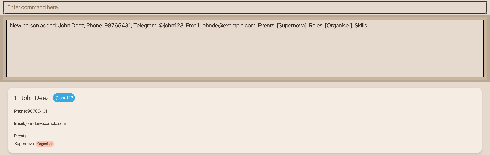
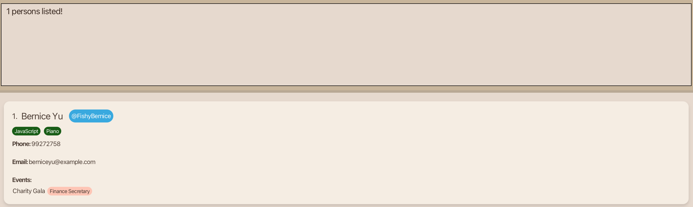

# User Guide

Meet **LinkUp**, a desktop app designed to help team leaders manage their contacts more efficiently and effectively.
Optimized for users who prefer typing commands to use systems, **LinkUp** helps you manage your contacts without 
ever taking your hands off your keyboard.

--------------------------------------------------------------------------------------------------------------------
## **About LinkUp**
### Target Users
This app is tailored for **community and club leaders** responsible for:
* Tracking members' events and roles
* Recording members' skills to efficiently allocate work
* Communicating with members via messaging platforms (e.g. Telegram)

### What do you need?
**Basic Digital Literacy:**
* You should know how to download software and type commands
* You should have experience with keyboard-driven workflows to tackle tasks efficiently

**Technical Requirements:**
* A Mac, Windows, or Linux computer
* 50MB of available storage space

### Where do you start?
* **New users:** Start from the [_Getting Started_ section](#getting-started) to set up LinkUp on your computer
* **Existing users:** Go to the [_Features_ section](#features) for command details
* **Advanced users:** Refer to the [_Command Summary_](#command-summary) for quick command guide

--------------------------------------------------------------------------------------------------------------------

## **Getting Started**

Let's walk you through the setup process of LinkUp.

1. **Prerequisites:**  
   You are required to install a specific version of the Java Development Kit (JDK) to run **LinkUp**. A JDK is a software package that provides the tools needed to develop and run Java applications.
   * **Mac users:** Follow the JDK installation guide [here](https://se-education.org/guides/tutorials/javaInstallationMac.html)
   to ensure you have the precise version prescribed.
   * **Windows users:** Follow the JDK installation guide [here](https://se-education.org/guides/tutorials/javaInstallationWindows.html)
   to ensure you have the precise version prescribed.
   * **Linux users:** Follow the JDK installation guide [here](https://se-education.org/guides/tutorials/javaInstallationLinux.html)
   to ensure you have the precise version prescribed.

2. **Download LinkUp:**  
   Install the latest `LinkUp.jar` file from [here](https://github.com/AY2526S1-CS2103T-F13-2/tp/releases).

3. **Move It:**  
   Place the `LinkUp.jar` file in your preferred folder in your computer.

4. **Launch It**:  
   Open the command terminal of your computer.
    * **Mac users:** Press Command + Space, type Terminal, and press Enter, to open the command terminal.
    * **Windows users:** Click the Start Menu, type cmd, and open Command Prompt, to open the command terminal.  
   Navigate into the folder you put the `LinkUp.jar` file in. You can do this by using the `cd` function. For example, if `LinkUp.jar` is in the Downloads folder of your computer,
   type `cd Downloads` in the command terminal to navigate into the Downloads folder.
   Finally, type `java -jar LinkUp.jar` command to run the application.   In a few seconds, the LinkUp interface will appear. 

5. **Use It**:  
   Now you can start using **LinkUp**. Refer to the [_Features_ section](#features) below for details of each command.

--------------------------------------------------------------------------------------------------------------------

## **Features**

<box type="info" seamless>

**:information_source:  Notes about the command format:** 

* Words in uppercase are information you need to provide. 
  e.g. For `add n/NAME`, replace `NAME` with an actual name.
  * You can type in `add n/John Doe` or `add n/Michael Jordan` etc.

* Items in square brackets are optional. 
  e.g. In `n/NAME [s/SKILL]`, `s/SKILL` is optional.
  * You can type `n/John Doe s/Java` or `n/John Doe`.

* Items with `…`​ after them can be used multiple times (including not at all). 
  e.g. `[s/SKILL]…​` means you can add 0 skills, 1 skill, or many.
  * You can type ` ` (i.e. 0 times), `s/Java`, or `s/Photography s/Cooking` etc.

* Fields can be in any order. 
  e.g. If a command specifies `n/NAME p/PHONE_NUMBER`, `p/PHONE_NUMBER n/NAME` is also acceptable.

* Extra parameters for commands that do not take in parameters (such as `help`, `list`, `exit` and `clear`) will be ignored. 
  e.g. If you type in `help 123`, it will be treated as just `help`.

* If you are using a PDF version of this document, be careful when copying and pasting commands that span multiple lines as
  space characters surrounding line-breaks may be omitted when copied over to the application.
  </box>

### View Help

View a brief message on commands you can use and a pop-up message explaining how to access the help page.

**Format**:   `help` or `h`

### Add a Contact

Add a person to the address book.

**Format:**   `add n/NAME p/PHONE_NUMBER e/EMAIL t/TELEGRAM_HANDLE ev/EVENT r/ROLE [s/SKILL]…​` or  
`a n/NAME p/PHONE_NUMBER e/EMAIL t/TELEGRAM ev/EVENT r/ROLE [s/SKILL]…​`

**Tip:**
A person can have any number of skills (including 0)

**Example Input:**  
`add n/John Deez p/98765431 ev/Supernova r/Organiser e/johnde@example.com t/john123`

**Expected Output:**  
  

<box type="tip" seamless>
**Tip:** The order of fields do not matter.
</box>

### List all Contacts

View a list of all persons in the address book.

**Format**:   `list` or `l`

### Edit a Contact

Edit the details of an existing person in the address book.

**Format**:   `edit INDEX [n/NAME] [p/PHONE] [e/EMAIL] [t/TELEGRAM_HANDLE] [ev/EVENT] [r/ROLE] [s/SKILL]…​` or  
`e INDEX [n/NAME] [p/PHONE] [e/EMAIL] [t/TELEGRAM_HANDLE] [ev/EVENT] [r/ROLE] [s/SKILL]…​`

* Edit the details of the person at the specified `INDEX`. The index refers to the index number shown in the displayed person list. The index must be a positive integer 1, 2, 3, …​
* At least one of the optional fields must be provided.
* When editing skills, the existing skills of the person will be removed and replaced with your skills input i.e adding of skills is not cumulative.
* You can remove a person’s skills by typing `s/` without specifying any skills after it.

**Example Input:**  
`edit 1 p/91234567 e/johndoe@example.com` edits the phone number and email address of the 1st person to be `91234567` and `johndoe@example.com` respectively.

**Expected Output:**  
`Edited Person: John Deez; Phone: 91234567; Telegram: john123; Email: johndoe@example.com; Role: Organiser; Event: Supernova; Skills:`

**Example Input:**  
`e 2 n/Betsy Crower s/` edits the name of the 2nd person to be `Betsy Crower` and clears all existing skills.

**Expected Output:**  
`Edited Person: Betsy Crower; Phone: 1234567; Telegram: crownie; Email: betsycrowe@example.com; Role: Organiser; Event: Supernova; Skills:`

### Search for Contacts by Name

Find persons whose names contain any of the given keywords.

**Format:**   `find KEYWORD [MORE_KEYWORDS]` or `f KEYWORD [MORE_KEYWORDS]`

* The search is case-insensitive. e.g. `hans` will match `Hans`.
* The order of the keywords does not matter. e.g. `Hans Bo` will match `Bo Hans`.
* Only the name is searched.
* Only full words will be matched. e.g. `Han` will not match `Hans`.
* Persons matching at least one keyword will be returned.
  e.g. `Hans Bo` will return `Hans Gruber`, `Bo Yang`.

**Example Input:**  
`find alex david` or `f alex david`  

**Expected Output:**  
If there are Alex Yeoh and David Li in your contacts, they will be listed.

### Filter Contacts by any Fields

Filter contacts from the address book based on name, event, role, phone number, telegram, email and skills.

**Format:**   `filter [n/KEYWORD] [t/KEYWORD] [ev/KEYWORD] [r/KEYWORD] [s/KEYWORD]` or   
`fil [n/KEYWORD] [t/KEYWORD] [ev/KEYWORD] [r/KEYWORD] [s/KEYWORD]`

* Filter the address book based on specified `KEYWORD`.
* Filter and produces all possible outputs matching at least one `KEYWORD` from each field.
* At least one of the optional fields must be provided.
* Can filter many words of a field by using space. e.g. `n/Alice Bob` will match all people have `Alice` or `Bob` in their name
* The keyword is case-insensitive.
  * e.g. `filter ev/Supernova` is the same as `filter ev/supernova`.
* The keyword can be a part of the full word.
  * e.g. `filter n/Ali` will filter out a person named `Alice` as well!
* The keyword **can be any valid character** 1, a, @, …​
* If more than one field is provided, LinkUp will filter contacts that match **all** the fields provided.

**Example Input:**  
Using the sample AddressBook below:

Typing the command `filter ev/charity gala` will show:

All of your contacts with `Charity Gala` in their event will be listed out. 

Another example command `filter n/Mike ev/Charity` will show:

This time, only contacts with both `Mike` in their name and `Charity` in their event will be listed.

### Delete Contacts

Delete specified persons from the address book.

**Format:**   `delete INDEX` or `d INDEX`

* Delete the person at the specified `INDEX`.
* At least one `INDEX` must be provided.
* The index refers to the index number shown in the displayed person list.
* The index **must be a positive integer** 1, 2, 3, …​

**Example Input:**  
`list` followed by `delete 1 2` deletes both the 1st and 2nd persons in the address book.

**Expected Output:**  
`Deleted Person: John Deez; Phone: 91234567; Telegram: john123; Email: johndoe@example.com; Role: Organiser; Event: Supernova; Skills:, Betsy Crower; Phone: 1234567; Telegram: crownie; Email: betsycrowe@example.com; Role: Organiser; Event: Supernova; Skills:`

**Example Input:**  
`find Betsy` followed by `d 1` deletes the 1st person in the results of the `find` command.

**Expected Output:**  
`Deleted Person: Betsy Crower; Phone: 1234567; Telegram: crownie; Email: betsycrowe@example.com; Role: Organiser; Event: Supernova; Skills:`
 
### Delete ALL Contacts

Clear all persons from the address book.

**Format:**   `clear`

**Expected Output:**  
`Address book has been cleared!`

### Add a Contact to Favourites

Add a specified person from the address book to favourites.

**Format:**   `fav INDEX`

* Add the person at the specified `INDEX` to favourites.
* The index refers to the index number shown in the displayed person list.
* The index **must be a positive integer** 1, 2, 3, …​

**Example Input:**  
`list` followed by `fav 1` adds the 1st person in the address book to favourites.

**Expected Output:**  
`Marked John Deez as favourite.`

**Example Input:**  
`find Betsy` followed by `fav 1` adds the 1st person in the results of the `find` command to favourites.

**Expected Output:**  
`Marked Betsy Crower as favourite.`

### Remove a Contact from Favourites

Remove a specified person from the address book from favourites.

**Format:**   `unfav INDEX`

* Remove the person at the specified `INDEX` from favourites.
* The index refers to the index number shown in the displayed person list.
* The index **must be a positive integer** 1, 2, 3, …​

**Example Input:**  
`list` followed by `unfav 1` removes the 1st person in the address book from favourites.

**Expected Output**  
`Unmarked John Deez from favourites.`

**Example Input:**  
`find Betsy` followed by `unfav 1` removes the 1st person in the results of the `find` command from favourites.

**Expected Output:**  
`Unmarked Betsy Crower from favourites.`

### List all Favourite Contacts

View a list of all your favourite persons in the address book.

**Format:**   `lfav`

### Close LinkUp

Exit the application. 

**Format:**   `exit`

The Graphic User Interface (GUI) will close after the input. LinkUp saves your contact list automatically in your computer. 
This means that your contact list will be restored whenever you reopen LinkUp.

### Save the Data

LinkUp data is saved in the hard disk automatically after any command that changes the data. There is no need to save manually.

### Edit the Data File

LinkUp data are saved automatically as a JSON file `[JAR file location]/data/addressbook.json`. Advanced users are welcome to update data directly by editing that data file.

<box type="warning" seamless>
**Caution:**
If your changes to the data file makes its format invalid, LinkUp will discard all data and start with an empty data file at the next run.  Hence, it is recommended to take a backup of the file before editing it. 
Furthermore, certain edits can cause LinkUp to behave in unexpected ways (e.g., if a value entered is outside the acceptable range). Therefore, edit the data file only if you are confident that you can update it correctly.
</box>

--------------------------------------------------------------------------------------------------------------------
## **Command Summary**

Action | Command
--------|------------------
**Add**:   Add a contact | `add n/NAME p/PHONE_NUMBER e/EMAIL t/TELEGRAM_HANDLE ev/EVENT r/ROLE [s/SKILL]…​`     e.g. `add n/James Ho p/22224444 e/jamesho@example.com t/james0336 s/Python s/Java`
**Clear**:   Delete all contacts | `clear`
**Delete**:   Delete contacts | `delete INDEX`    e.g. `delete 3`
**Edit**:   Edit a contact | `edit INDEX [n/NAME] [p/PHONE_NUMBER] [e/EMAIL] [t/TELEGRAM_HANDLE] [ev/EVENT] [r/ROLE] [s/SKILL]…​`    e.g.`edit 2 n/James Lee e/jameslee@example.com`
**Find**:   Search for a contact by name | `find KEYWORD [MORE_KEYWORDS]`    e.g. `find James Jake`
**Filter**:   Filter contacts by any fields | `filter [n/KEYWORD] [t/KEYWORD] [ev/KEYWORD] [r/KEYWORD] [s/KEYWORD]`    e.g. `filter ev/Hunt`
**List**:   List all contacts | `list`
**Favourite**:   Add a contact to favourites | `fav INDEX`    e.g. `fav 3`
**Unfavourite**:   Remove a contact from favourites | `unfav INDEX`    e.g. `unfav 3`
**List favourites**:   List all favourite contacts | `lfav`
**Help**:   View a brief message on commands you can use | `help`
**Exit**:   Exit LinkUp | `exit`

--------------------------------------------------------------------------------------------------------------------

## **Troubleshooting**
### Frequently Asked Questions

**Q**: How do I transfer my data to another computer?  
**A**: Install the app in the other computer and overwrite the empty data file it creates with the file that contains the data of your previous LinkUp home folder.

**Q**: How do I edit only 1 of my 2 skills for a specific contact?  
**A**: You would have to edit both skills in order for you to see the changes. So assuming
you have `skills: Boxing, Drumming` but you wish to change Drumming to Singing, you can only do this by using the `edit` command
and typing `edit [INDEX] s/Boxing s/Drumming` or `e [INDEX] s/Boxing s/Drumming`.

**Q**: Why am I unable to run the `LinkUp.jar` file?  
**A**: Ensure you have Java `17` or above installed in your computer. You can type `java -version` in your command terminal
of your computer to check.
* For Mac users, follow the setup guide [here](https://se-education.org/guides/tutorials/javaInstallationMac.html)
ensure you have the precise JDK version prescribed.
* For Windows users, follow the setup guide [here](https://se-education.org/guides/tutorials/javaInstallationWindows.html)
ensure you have the precise JDK version prescribed.
* For Linux users, follow the setup guide [here](https://se-education.org/guides/tutorials/javaInstallationLinux.html)
ensure you have the precise JDK version prescribed.

Then, open the command terminal of your computer, and navigate into the folder you put the `LinkUp.jar` file in.
You can do this by using the `cd` function. For example, if `LinkUp.jar` is in the Downloads folder of your computer,
type `cd Downloads` in the command terminal to navigate into the Downloads folder.
Finally, type `java -jar LinkUp.jar` command to run the application.  

### Known Issues

* **Issue:** When using multiple screens, if you move the application to a secondary screen, and later switch to using only the primary screen, the GUI will open off-screen.  
**Solution:** Delete the `preferences.json` file created by the application before running the application again.
* **Issue:** If you minimize the Help Window and then run the `help` command (or use the `Help` menu, or the keyboard shortcut `F1`) again, the original Help Window will remain minimized, and no new Help Window will appear.  
**Solution:** Manually restore the minimized Help Window.

### Common Error Messages

### Further Help & Support
* Visit our [GitHub Repository](https://github.com/AY2526S1-CS2103T-F13-2/tp) or [Developer Guide](https://ay2526s1-cs2103t-f13-2.github.io/tp/DeveloperGuide.html) for technical details.
* Post your query [here](https://github.com/AY2526S1-CS2103T-F13-2/tp/issues) by creating a new issue, detailing 
  * Your exact command input
  * Errors faced
  * Your computer's operating system
  * Your JDK Version 
  * Screenshots  
We will get back to you as soon as possible.

--------------------------------------------------------------------------------------------------------------------
## **Get in Touch with Us**
We’d love to hear from you! Whether you have questions, feedback, or suggestions for new features, feel free to reach out to us.

**Who We Are:**  
We are the AY2526S1-CS2103T-F13-2 team of developers passionate about creating efficient and user-friendly tools.

**Contact Information:**  
📧 Email: e1408873@u.nus.edu  
💬 GitHub Issue Page: [LinkUp Issues](https://github.com/AY2526S1-CS2103T-F13-2/tp/issues)

**Feature Suggestions:**  
Have an idea to make LinkUp even better? Post it in our GitHub Issues page or email us — we’re always looking to improve!
