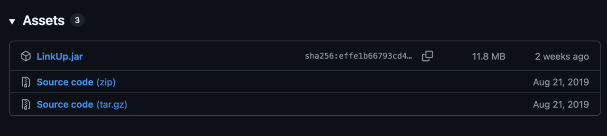
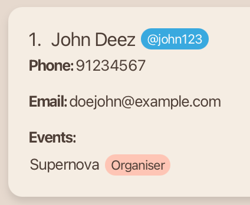
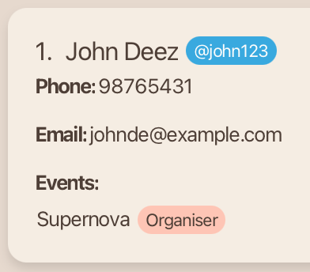
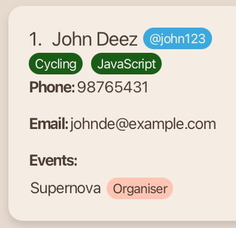
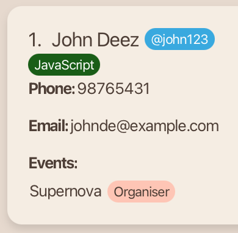
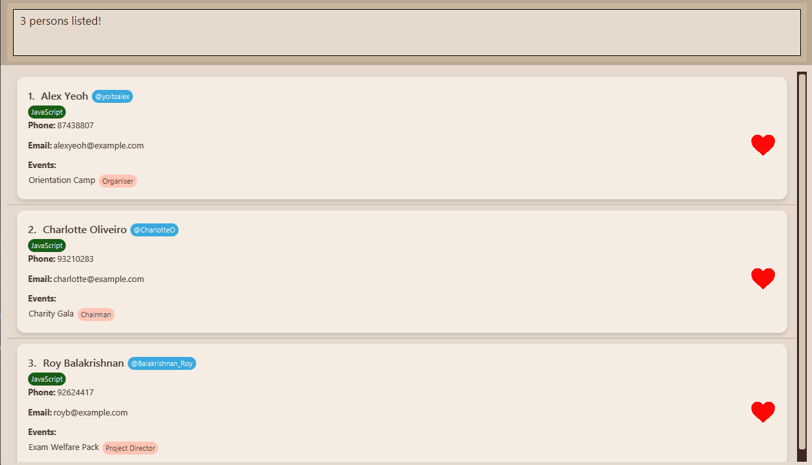

# User Guide

Meet **LinkUp**, a desktop app designed to help team leaders manage their contacts more efficiently and effectively.
Optimized for users who prefer typing commands to use systems, **LinkUp** helps you manage your contacts without 
ever taking your hands off your keyboard.

--------------------------------------------------------------------------------------------------------------------
## **About LinkUp**
### Target Users
This app is tailored for **community and club leaders** responsible for:
* Tracking members' events and roles
* Recording members' skills to efficiently allocate work
* Communicating with members via messaging platforms (e.g. Telegram)

### What do you need?
**Basic Digital Literacy:**
* You should know how to download software and type commands
* You should have experience with keyboard-driven workflows to tackle tasks efficiently

**Technical Requirements:**
* A Mac, Windows, or Linux computer
* 50MB of available storage space

### Where do you start?
* **New users:** Start from [_Quick Start_](#quick-start) to set up LinkUp on your computer
* **Existing users:** Go to [_Features_](#features) for command details
* **Advanced users:** Refer to the [_Command Summary_](#command-summary) for quick command guide

--------------------------------------------------------------------------------------------------------------------

## **Quick Start**

Let's walk you through the setup process of LinkUp.

1. **Prerequisites:** <br>
   You are required to install a specific version of the Java Development Kit (JDK) to run **LinkUp**. A JDK is a software package that provides the tools needed to develop and run Java applications.
    * **Mac users:** Follow the JDK installation guide [here](https://se-education.org/guides/tutorials/javaInstallationMac.html).
    * **Windows users:** Follow the JDK installation guide [here](https://se-education.org/guides/tutorials/javaInstallationWindows.html).
    * **Linux users:** Follow the JDK installation guide [here](https://se-education.org/guides/tutorials/javaInstallationLinux.html).

<box type="tip" seamless> 
    <b>Don't know your OS?</b> Click <a href="https://whatsmyos.com/" target="_blank" rel="noopener noreferrer">here </a> to check.
</box>

2. **Download LinkUp:** <br>
   To install the latest `LinkUp.jar` file:
   1. Go to the [LinkUp Releases Page](https://github.com/AY2526S1-CS2103T-F13-2/tp/releases).
   2. Scroll down the latest release section until you see a section an <b>Assets</b> header, which looks like this:
   
   3. Click on the file that ends with ".jar" to automatically download the latest `LinkUp.jar` file. 

<br>

3. **Move It:** <br>
   Place the `LinkUp.jar` file in your preferred folder in your computer.

4. **Launch It**: <br>
    1. Open the command terminal of your computer
       * **Mac users:** Open Terminal via Spotlight (⌘ + Space → type _Terminal_ → press _return_ ).
       * **Windows users:** Open Command Prompt by: Press Win + R → type cmd → press _Enter_
       * **Linux users:** Open Terminal via Ctrl + Alt + T or search for it in your application menu.

       <br>

    2. Navigate into the folder you put the `LinkUp.jar` file in.
       *  You can do this by using the change directory (`cd`) function. For example, if `LinkUp.jar` is in the Downloads folder of your computer,
          type `cd Downloads` in the command terminal to navigate into the Downloads folder.

       <br>

    3. Type `java -jar LinkUp.jar` command to run the application.
    4. In a few seconds, the LinkUp interface will appear. 
   Scroll down for [_Interface Walkthrough_](#interface-walkthrough).
    5. Use It: <br>
   Now you can start using **LinkUp**. Refer to the [_Features_](#features) below for details of each command.

--------------------------------------------------------------------------------------------------------------------

## **Interface Walkthrough**

 <br>

Moving from the top of the interface to the bottom:
1. **Menu Bar:** Contains two buttons for File and Help for you to click on and utilise if necessary.
2. **Command Box:** You will input commands here to make changes to the contact list.
3. **Result Box:** After you input a command, the result box will notify you on whether it is successful or not.
4. **Contact List:** Here is where all your contacts will be displayed, with a scroll bar for you to use if you want to look through your contact list.

--------------------------------------------------------------------------------------------------------------------

## **Features**

<box type="info" seamless>

**Notes about the command format:**<br>

* **Words in uppercase are information you need to provide.**<br>
  e.g. For `add n/NAME`, replace `NAME` with an actual name.
  * You can type in `add n/John Doe` or `add n/Michael Jordan` etc.
  
  <br>

* **Items in square brackets are optional.**<br>
  e.g. In `n/NAME [sk/SKILL]`, `sk/SKILL` is optional.
  * You can type `n/John Doe sk/Java` or `n/John Doe`.

  <br>

* **Items with `…`​ after them can be used multiple times.**<br>
  e.g. `r/ROLE…​` means you can add as many roles as you want.
  * You can type `r/Organiser`, or `r/Organiser r/Participant` etc.

  <br>
  
* **All fields, apart from event and role, can be in any order.**<br>
  e.g. If a command specifies `n/NAME p/PHONE`, `p/PHONE n/NAME` is also acceptable.

* **Extra parameters for commands that do not take in parameters** (such as `help`, `list`, `exit` and `clear`) **will be ignored.**<br>
  e.g. If you type in `help 123`, it will be treated as just `help`.

* **Commands are case-insensitive.**<br>
    e.g. If you type in `edit 1 ev/Orientation r/Organiser` or `EDIT 1 ev/Orientation r/Organiser`.

* If you are using a PDF version of this document, be careful when copying and pasting commands that span multiple lines as
  space characters surrounding line-breaks may be omitted when copied over to the application.
  </box>

### Help & Exit
#### 1. View Help

View a brief message on commands you can use and a pop-up message explaining how to access the help page.

**Format**: <br> `help` or `h`

**Expected Output:** <br>
 <br>

#### 2. Close LinkUp

Exit the application.

**Format:** <br> `exit` or `ex`

The User Interface will close after the input. LinkUp saves your contact list automatically in your computer, and 
your contact list will be restored whenever you reopen LinkUp.

<br>

### Contact Management
#### 3. Add a Contact

Add a person to the address book.

**Format:** <br> `add n/NAME p/PHONE e/EMAIL t/TELEGRAM ev/EVENT…​ r/ROLE…​ [sk/SKILL]…​` or <br>
`a n/NAME p/PHONE e/EMAIL t/TELEGRAM ev/EVENT…​ r/ROLE…​ [sk/SKILL]…​`

**Parameters:** <br>
`n/NAME`: Name of the person. <br>
`p/PHONE`: Phone number of the person. <br>
`e/EMAIL`: Email address of the person. <br>
`t/TELEGRAM`: Telegram handle of the person. <br>
`ev/EVENT`: Event of the person. <br>
`r/ROLE`: Role of the person. <br>
`sk/SKILL`: Skill of the person. <br>

* Each event **must** have only one corresponding role. You are adding event-role pairs, not independent events or roles.
As such, you **cannot** add 1 event and 2 roles, the 2nd role will be discarded.
* You can add one or more event-role pairs, but ensure that each `ev/EVENT` and its corresponding `r/ROLE` are **beside each other**.
* Duplicate contacts with the same name, phone number, email, and telegram handle are not allowed.

<box type="tip" seamless>
A person can have <i>any non-negative number</i> of skills including 0. The order of fields,
apart from event and role, does not matter.
</box>

**Example Input:** <br>
```
add n/John Deez p/98765431 ev/Supernova r/Organiser e/johnde@example.com t/john123
```

**Expected Output:** <br>
 <br>

<br>

#### 4. Edit a Contact

Edit the details of an existing person in the address book.

**Format**: <br> `edit INDEX [n/NAME] [p/PHONE] [e/EMAIL] [t/TELEGRAM] [ev/EVENT]…​ [r/ROLE]…​ [sk/SKILL]…​` or <br>
`e INDEX [n/NAME] [p/PHONE] [e/EMAIL] [t/TELEGRAM] [ev/EVENT]…​ [r/ROLE]…​ [sk/SKILL]…​`

* Edit the details of the person at the specified `INDEX`, which refers to the index number shown in the contact list. 
* The **index must be a positive integer** 1, 2, 3, …​
* **At least** one of the optional fields must be provided.
* When you perform the action of editing the skills, the existing skills of the person will all be removed and replaced with your skills input i.e adding of skills is not cumulative.
* You can remove a person’s skills by typing `sk/` without specifying any skills after it.
* Each event **must** have only one corresponding role. You cannot edit an event or role only.
* When editing an event and its corresponding role, the existing events and roles will all be removed and replaced with your new event and role input i.e adding of events and roles is not cumulative.
* You can add one or more event-role pairs, but ensure that each `ev/EVENT` and its corresponding `r/ROLE` are **beside each other**.
* Duplicate contacts with the same name, phone number, email, and telegram handle are not allowed.

**Parameters:** <br>
`INDEX`: Index number of person in contact list. <br>
`n/NAME`: Name of the person. <br>
`p/PHONE`: Phone number of the person. <br>
`e/EMAIL`: Email address of the person. <br>
`t/TELEGRAM`: Telegram handle of the person. <br>
`ev/EVENT`: Event of the person. <br>
`r/ROLE`: Role of the person. <br>
`sk/SKILL`: Skill of the person. <br>

**Example Input:** <br>
```
edit 1 p/91234567 e/doejohn@example.com
```

**Expected Output:** <br>
```
Edited Person: John Deez; Phone: 91234567; Telegram: @john123; Email: doejohn@example.com; Events: [Supernova]; Roles: [Organiser]; Skills: 
```
| Initial Contact | Final Contact |
|-----------------|----------------|
|   |  |

**Example Input:** <br>
```
e 2 n/Rebecca Tan sk/
```

**Expected Output:** <br>
```
Edited Person: Rebecca Tan; Phone: 99272758; Telegram: @FishyBernice; Email: berniceyu@example.com; Events: [Charity Gala]; Roles: [Finance Secretary]; Skills: 
```

| Initial Contact | Final Contact |
|-----------------|----------------|
|  |  |

<br>

#### 5. Delete Contacts

Delete specified persons from the address book.

**Format:** <br> `delete INDEX…` or `d INDEX…`

* Delete the person at the specified `INDEX`.
* At least one `INDEX` must be provided.
* The index **must be a positive integer** 1, 2, 3, …​

**Parameters:** <br>
`INDEX`: Index number of person in contact list. <br>

**Example Input:** <br>
```
delete 1 2 
```
This input deletes both the 1st and 2nd person listed in the contact list.<br><br>
**Expected Output:** <br>
```
Deleted Person: 
John Deez; Phone: 91234567; Telegram: @john123; Email: johndoe@example.com; Role: Organiser; Event: Supernova; Skills:, 
Betsy Crower; Phone: 1234567; Telegram: @crownie; Email: betsycrowe@example.com; Role: Organiser; Event: Supernova; Skills:
```

**Example Input:** <br>
```
d 1 
```
This input deletes the 1st person listed in the contact list.<br><br>
**Expected Output:** <br>
```
Deleted Person: 
Betsy Crower; Phone: 1234567; Telegram: @crownie; Email: betsycrowe@example.com; Role: Organiser; Event: Supernova; Skills:
```

<br>

#### 6. Copy Contact
Copy an existing contact to make it easier to add a person with similar parameters.

**Format:** <br> `copy INDEX` or `c INDEX`

* Copies the Add Command input of the person at the specified `INDEX` to the clipboard so that you can paste (ctrl/cmd + v) into the command box.
* The index **must be a positive integer** 1, 2, 3, …​

**Parameters:** <br>
`INDEX`: Index number of person in contact list. <br>

**Example Input:** <br>
```
copy 1
```
This input copies the 1st person listed in the contact list.<br><br>
 <br>

**Expected Output:** <br>
```
Copied add command for John Deez to clipboard!
If paste (ctrl/cmd + v) does not work, here is the add command string for you to manually copy:
add n/John Deez p/98765431 e/johnde@example.com t/john123 ev/Supernova r/Organiser
```

<br>

#### 7. Delete ALL Contacts

Clear address book by deleting all persons from it.

**Format:** <br> `clear`

**Expected Output:** <br>
```
Address book has been cleared!
```

<box type="warning" seamless>
    <b>Caution:</b>
    This command deletes ALL your contacts permanently. You are recommended to double-check before using this command.
</box>

<br>

### Contact Viewing & Searching

#### 8. List all Contacts

View a list of all persons in the address book.

**Format**: <br> `list` or `l`

<br>

#### 9. Search for Contacts by Name

Find persons whose names contain any of the given keywords.

**Format:** <br> `find KEYWORD [MORE_KEYWORDS]` or `f KEYWORD [MORE_KEYWORDS]`

* The search is case-insensitive. e.g. `hans` will match `Hans`.
* The order of the keywords does not matter. e.g. `Hans Bo` will match `Bo Hans`.
* Only the name is searched.
* Only full words will be matched. e.g. `Han` will not match `Hans`.
* Persons matching at least one keyword will be returned.
  e.g. `Hans Bo` will return `Hans Gruber`, `Bo Yang`.

**Example Input:** <br>
```
find alex david
``` 
<br>

**Expected Output:** <br>
If there are Alex Yeoh and David Li in your contacts, they will be listed.

<br>

#### 10. Filter Contacts by any Fields

Filter contacts from the address book based on name, event, role, phone number, telegram handle, email and skills.

**Format:** <br> `filter [n/KEYWORD] [t/KEYWORD] [ev/KEYWORD] [r/KEYWORD] [sk/KEYWORD]` or <br> 
`fil [n/KEYWORD] [t/KEYWORD] [ev/KEYWORD] [r/KEYWORD] [sk/KEYWORD]`

* Filter the address book based on your specified `KEYWORD`.
* Filter and produces all possible outputs matching at least one `KEYWORD` from each field.
* At least one of the optional fields must be provided.
* Can filter many words of a field by using space. e.g. `n/Alice Bob` will match all people have `Alice` or `Bob` in their name.
* The keyword is case-insensitive.
  * e.g. `filter ev/Supernova` is the same as `filter ev/supernova`.
* The keyword can be a part of the full word.
  * e.g. `filter n/Ali` will filter out a person named `Alice` as well!
* The keyword **can be any valid character** for that field: e.g. 1, a, @ (for email), …​
* If more than one field is provided, LinkUp will filter contacts that match **all** the fields provided.

**Example Input:** <br>
Using the sample AddressBook below:


Typing the command `filter ev/charity gala` will show:


All of your contacts with `Charity Gala` in their event will be listed out. 

Another example command `filter n/Mike ev/Charity` will show:


This time, only contacts with both `Mike` in their name and `Charity` in their event will be listed.

<br>

### Skill Management
#### 11. Add new Skill
Add skill to an existing person from the address book.

**Format:** <br> `addskill INDEX [sk/SKILL]…` or `as INDEX [sk/SKILL]…`

* Adds one or more skills to the person at the specified `INDEX`.
* At least one `INDEX` must be provided.
* The index **must be a positive integer** 1, 2, 3, …​

**Parameters:** <br>
`INDEX`: Index number of person in contact list. <br>
`sk/SKILL`: Skill of your contact. <br>

**Example Input:** <br>
```
addskill 1 sk/JavaScript sk/Cycling
```

<box type="tip" seamless>
Adding skills using the addskill command is cumulative, unlike the edit command.
</box>

**Expected Output:** <br>
```
Added skill [Cycling], [JavaScript] to John Deez
```
| Initial Contact                                      | Final Contact                                      |
|------------------------------------------------------|----------------------------------------------------|
|  |  |

<br>

#### 12. Delete existing Skill
Delete skills of an existing person from the address book.

**Format:** <br> `dskill INDEX [sk/SKILL]…` or `ds INDEX [sk/SKILL]…`

* Delete one or more skills of the person at the specified `INDEX`.
* At least one `INDEX` must be provided.
* The index **must be a positive integer** 1, 2, 3, …​

**Parameters:** <br>
`INDEX`: Index number of person in contact list. <br>
`sk/SKILL`: Skill of your contact. <br>

**Example Input:** <br>
```
dskill 1 sk/Cycling
```

**Expected Output:** <br>
```
Deleted skills [Cycling] from John Deez
```
| Initial Contact                                      | Final Contact                                    |
|------------------------------------------------------|--------------------------------------------------|
|  |  |


<br>

### Favourite Contact Management
#### 13. Add a Contact to Favourites

Add a person from the address book to favourites and mark them with a heart icon.

**Format:** <br> `fav INDEX`

* Add the person at the specified `INDEX` to favourites.
* The index refers to the index number of the person shown in the contact list.
* The index **must be a positive integer** 1, 2, 3, …​

**Parameters:** <br>
`INDEX`: Index number of person in contact list. <br>

**Example Input:** <br>
```
fav 1
```
This input adds the 1st person listed in the contact list to favourites.<br><br>
**Expected Output:** <br>
```
Marked John Deez as favourite.
```
| Initial Contact                                        | Final Contact                                    |
|--------------------------------------------------------|--------------------------------------------------|
|  | |

<br>

#### 14. Remove a Contact from Favourites

Remove a specified person from the address book from favourites and removes the heart icon.

**Format:** <br> `unfav INDEX`

* Remove the person at the specified `INDEX` from favourites.
* The index refers to the index number of the person shown in the contact list.
* The index **must be a positive integer** 1, 2, 3, …​

**Parameters:** <br>
`INDEX`: Index number of person in contact list. <br>

**Example Input:** <br>
```
unfav 1
```
This input removes the 1st person listed in the contact list from favourites.<br><br>
**Expected Output** <br>
```
Unmarked John Deez from favourites.
```
| Initial Contact                                        | Final Contact                                    |
|--------------------------------------------------------|--------------------------------------------------|
|  | |

<br>

#### 15. List all Favourite Contacts

View a list of all your favourite persons in the address book.

**Format:** <br> `lfav`

**Sample Output:** <br>



<br>

### Data Storage
#### 16. Save the Data

LinkUp data is saved in the hard disk automatically after any command that changes the data. There is no need to save manually.

<br>

#### 17. Edit the Data File

LinkUp data are saved automatically as a JSON file `[JAR file location]/data/addressbook.json`. Advanced users are welcome to update data directly by editing that data file.

<box type="warning" seamless>
    <b>Caution:</b>
    If you edit the data file incorrectly and make its format invalid, LinkUp will not load any contacts at startup.
    Adding a new person in this state will cause LinkUp to <i>overwrite the existing file</i> with only the new contact.
    Therefore, it is recommended to <i>always back up your data file</i> before making manual changes.
</box>

--------------------------------------------------------------------------------------------------------------------
## **Command Summary**

Action | Command
--------|------------------
**Help**: <br> View a brief message on commands you can use | `help` or `h`
**Exit**: <br> Exit LinkUp | `exit` or `ex`
**Add**: <br> Add a contact | `add n/NAME p/PHONE e/EMAIL t/TELEGRAM ev/EVENT…​ r/ROLE…​ [sk/SKILL]…​` or <br>`a n/NAME p/PHONE e/EMAIL t/TELEGRAM ev/EVENT…​ r/ROLE…​ [sk/SKILL]…​` <br> <br> e.g. `add n/John Deez p/98765431 ev/Supernova r/Organiser e/johnde@example.com t/john123`
**Edit**: <br> Edit a contact | `edit INDEX [n/NAME] [p/PHONE] [e/EMAIL] [t/TELEGRAM] [ev/EVENT]…​ [r/ROLE]…​ [sk/SKILL]…​` or <br>`e INDEX [n/NAME] [p/PHONE] [e/EMAIL] [t/TELEGRAM] [ev/EVENT]…​ [r/ROLE]…​ [sk/SKILL]…​`<br> <br> e.g.`edit 2 n/James Lee e/jameslee@example.com`
**Delete**: <br> Delete contacts | `delete INDEX…` or `d INDEX…` <br> <br> e.g. `delete 3` or `delete 1 3 5`
**Copy**: <br> Copy an existing contact to make it easier to add a person with similar parameters | `copy INDEX` or `c INDEX`<br> <br> e.g. `copy 2`
**Clear**: <br> Delete all contacts | `clear`
**List**: <br> List all contacts | `list` or `l`
**Find**: <br> Search for a contact by name | `find KEYWORD [MORE_KEYWORDS]` or <br> `f KEYWORD [MORE_KEYWORDS]` <br> <br> e.g. `find James Jake`
**Filter**: <br> Filter contacts by any fields | `filter [n/KEYWORD] [t/KEYWORD] [ev/KEYWORD] [r/KEYWORD] [sk/KEYWORD]` or <br> `fil [n/KEYWORD] [t/KEYWORD] [ev/KEYWORD] [r/KEYWORD] [sk/KEYWORD]` <br> <br> e.g. `filter ev/Hunt`
**Add Skill**: <br> Add skill(s) to contact | `addskill INDEX [sk/SKILL]…` or <br> `as INDEX [sk/SKILL]…` <br> <br> e.g. `addSkill 1 sk/JavaScript`
**Delete Skill**: <br> Delete skill(s) from contact | `dskill INDEX [sk/SKILL]…` or <br> `ds INDEX [sk/SKILL]…` <br> <br> e.g. `dskill 2 sk/Cycling`
**Favourite**: <br> Add a contact to favourites | `fav INDEX`<br> <br> e.g. `fav 3`
**Unfavourite**: <br> Remove a contact from favourites | `unfav INDEX`<br> <br> e.g. `unfav 3`
**List favourites**: <br> List all favourite contacts | `lfav`

--------------------------------------------------------------------------------------------------------------------

## **Troubleshooting**
### Frequently Asked Questions

#### 1. Launching LinkUp
**Why am I unable to run the `LinkUp.jar` file?** <br>
Ensure you have Java `17` or above installed in your computer. After installing LinkUp, type `java -jar LinkUp.jar` in your command terminal to launch LinkUp.
Refer to [_Quick Start_](#quick-start) for the detailed LinkUp launching process.

#### 2. LinkUp Data
**How do I save my data in LinkUp?** <br>
LinkUp data is saved in your computer automatically after any command that changes the data. There is no need to save manually. This means that your contact list will be restored whenever you reopen LinkUp. <br>

**How do I transfer my data to another computer?** <br>
Install LinkUp on the other computer, then replace the new data file in your other computer with the data file from your original computer's LinkUp. <br>

#### 3. Contact Detail Management
**How do I edit only 1 of my 2 skills for a specific contact?** <br>
You would have to edit both skills in order for you to see the changes. So assuming
you have `skills: Boxing, Drumming` but you wish to change Drumming to Singing, you can only do this by using the `edit` command
and typing `edit [INDEX] sk/Boxing sk/Drumming` or `e [INDEX] sk/Boxing sk/Drumming`.

**Why am I unable to run the `LinkUp.jar` file?** <br>
Ensure you have Java `17` or above installed in your computer and the correct `LinkUp.jar` file. 
Follow the instructions at [_Quick Start_ ](#quick-start) to re-download the Java Developer Kit (JDK) and `LinkUp.jar` file.
To ensure that the JDK version is correct, type `java -version` in the command terminal of your computer to check.

**How do I add multiple roles and events to an existing contact?** <br>
You can use the `edit` command. So assuming your contact is a participant for an EWP event, and an invigilator for an exam event,
you can type `edit [INDEX] ev/EWP r/Participant ev/Exam r/Invigilator`. Ensure that the `ev/EVENT` and the corresponding `r/ROLE` are
beside each other.

**How do I edit only 1 of my 2 event-role pairs for a specific contact?** <br>
You would have to edit both event-role pairs in order for you to see the changes. So assuming
you have `Events: [AngBao Hunt, Exam]; Roles: [Organiser, Invigilator]` but you wish to change Ang Bao Hunt to EWP, you can only do this by using the `edit` command
and typing `edit [INDEX] ev/EWP r/Organiser ev/Exam r/Invigilator` or `e [INDEX] ev/EWP r/Organiser ev/Exam r/Invigilator`. <br>

**Can I edit event information of a contact only?** <br>
No. You would have to edit the role of the contact too. Each event should have a corresponding role. So assuming you have
`Events: [AngBao Hunt]; Roles: [Organiser]` but you wish to change AngBao Hunt to Exam, you can only do this by using the `edit` command
and typing `edit [INDEX] ev/Exam r/Organiser` or `e [INDEX] ev/Exam r/Organiser`. <br>

**What if I type 2 events and 1 role when adding/editing a contact?** <br>
Assuming you typed `edit [INDEX] ev/EWP r/Participant ev/Exam`, the 2nd event will not be saved. Only `Events: [EWP]; Roles: [Participant]`
will be saved. Each event should have a corresponding role.

**Can I add a new contact with the same phone number?** <br>
Adding a contact with an existing phone number / email address / name / telegram handle is not allowed.

### Known Issues

* **Issue:** When using multiple screens, if you move the application to a secondary screen, and later switch to using only the primary screen, the GUI will open off-screen. <br>
**Solution:** Delete the `preferences.json` file created by the application before running the application again.
* **Issue:** If you minimize the Help Window and then run the `help` command (or use the `Help` menu, or the keyboard shortcut `F1`) again, the original Help Window will remain minimized, and no new Help Window will appear. <br>
**Solution:** Manually restore the minimized Help Window.

### Further Help & Support
* Visit our [GitHub Repository](https://github.com/AY2526S1-CS2103T-F13-2/tp) or [Developer Guide](https://ay2526s1-cs2103t-f13-2.github.io/tp/DeveloperGuide.html) for technical details.
* Post your query [here](https://github.com/AY2526S1-CS2103T-F13-2/tp/issues) by creating a new issue, detailing 
  * Your exact command input
  * Errors faced
  * Your computer's operating system
  * Your JDK Version 
  * Screenshots <br>
We will get back to you as soon as possible.

--------------------------------------------------------------------------------------------------------------------
## **Get in Touch with Us**
We’d love to hear from you! Whether you have questions, feedback, or suggestions for new features, feel free to reach out to us.

**Who We Are:** <br>
We are the AY2526S1-CS2103T-F13-2 team of developers passionate about creating efficient and user-friendly tools.

**Contact Information:** <br>
📧 Email: e1408873@u.nus.edu <br>
💬 GitHub Issue Page: [LinkUp Issues](https://github.com/AY2526S1-CS2103T-F13-2/tp/issues)

**Feature Suggestions:** <br>
Have an idea to make LinkUp even better? Post it in our GitHub Issues page or email us — we’re always looking to improve!
